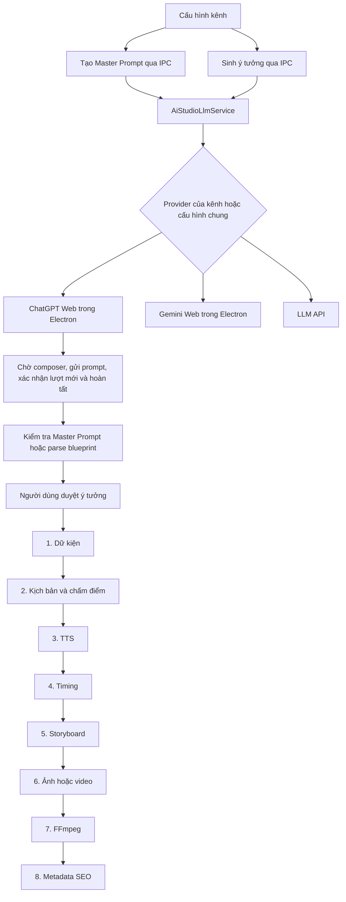

# Kiểm tra AIstudio và ChatGPT Web — 05/10/2026

Đã kiểm tra mã nguồn và chạy kiểm thử cục bộ. Nhánh ChatGPT hiện dùng Electron BrowserWindow với partition `persist:chatgpt_session`; không điều khiển Chrome đang mở và không dùng phiên đăng nhập của Chrome. Nút Chrome Bridge hiện phục vụ luồng Flow, không tự biến thành kết nối ChatGPT.

Các lỗi xác định được đã được sửa trong worktree. Chưa thử gửi prompt trên tài khoản ChatGPT thật, chưa xác nhận luồng đăng nhập/Cloudflare và chưa chạy xuất video đầu cuối. Không nên coi các kiểm thử dưới đây là chứng minh automation chạy ổn với mọi giao diện ChatGPT.

## Luồng hiện tại

Chế độ gated dừng sau mỗi bước 1–7 để người dùng duyệt. Tên bước 8 có chữ “Xuất bản”, nhưng phần thực thi được kiểm tra ở đây chỉ sinh metadata; không có thao tác đăng video lên mạng trong case 8.

## Những lỗi đã sửa

| Vấn đề trước sửa | Thay đổi |
| --- | --- |
| Poll lấy assistant cuối cùng trong hội thoại mà không kiểm tra lượt vừa gửi; có thể trả câu trả lời cũ | Ghi snapshot trước gửi; yêu cầu có user và assistant mới; chỉ nhận nội dung ổn định có control hoàn tất thuộc đúng lượt assistant |
| So sánh độ dài thay vì nội dung; sửa văn bản cùng độ dài có thể bị coi là ổn định | So sánh cả nội dung và message ID; reset thời gian ổn định khi thay đổi hoặc đang streaming |
| Dispatch Enter giả rồi báo thành công dù chưa biết đã gửi được hay chưa | Chờ composer và nút gửi hoạt động; xác nhận user turn xuất hiện; báo lỗi rõ nếu chưa xác nhận |
| Cookie bất kỳ chứa auth/jwt hoặc `oai-nav-state` bị coi là đăng nhập | Chỉ chấp nhận session cookie đúng domain ChatGPT, đúng tên và chưa hết hạn; vẫn cần kiểm tra giao diện thực tế khi chạy |
| Login wait không có giới hạn và phản hồi chỉ chờ 90 giây | Login wait tối đa 180 giây; phản hồi tối đa 240 giây; readiness dùng polling thay vì sleep cố định |
| Các job độc lập dùng lại hội thoại đang có, dễ lẫn ngữ cảnh kênh và nội dung | Job mới mở trang chat mới; lượt viết tiếp kịch bản giữ cùng hội thoại |
| Nhánh web viết kịch bản bỏ qua Master Prompt của kênh | Điền biến tên kênh/nguồn, giữ chỉ dẫn nội dung và bổ sung định dạng `CÂU X` cho parser |
| Sinh ý tưởng/kịch bản theo provider chung dù kênh chọn provider khác | Resolve provider từ cấu hình kênh; thông báo thành công ở modal dùng provider tương ứng |
| Key/model/base URL của provider cũ đi theo provider mới | Không chuyển thông tin đó sang provider khác; API cần cấu hình đúng nhà cung cấp |
| Provider web còn key cũ có thể rơi vào API ở các helper khác | `createClient` không tạo API client cho `chatgpt_web`/`gemini_web` |
| Master Prompt lỗi kết nối hoặc phản hồi ngắn bị thay bằng template và UI báo AI thành công | Khi có cấu hình provider, truyền lỗi về UI; kiểm tra cấu trúc và placeholder. Template còn dùng cho lời gọi chủ động không truyền cấu hình LLM |
| Blueprint không có dàn ý bị thay bằng bốn phân đoạn mẫu | Yêu cầu ít nhất hai phân đoạn chuỗi không rỗng; giữ jsonrepair và khôi phục văn bản có dàn ý thật |
| Sửa kịch bản chèn La Braña-Arintero/Tây Ban Nha/7.000 năm vào chủ đề khác | Bỏ dữ kiện cố định; dùng hook được cung cấp và nội dung gốc; cập nhật thời lượng sau chỉnh sửa |
| Duyệt bước sai trạng thái hoặc sai số bước có thể nhảy pipeline | Chỉ duyệt đúng bước đã thành công của phiên đang chờ duyệt |
| Resume nhận số bước sai hoặc gọi lại pipeline còn chạy | Validate 1–8 và chặn phiên còn controller đang chạy; vẫn cho phép khôi phục trạng thái running lưu từ lần chạy trước khi không còn controller |
| Cancel bỏ qua phiên đang chờ duyệt | Đánh dấu cancelled cả trạng thái awaiting_approval |
| Persist checkpoint phụ thuộc project đang mở | Ưu tiên outputDir của phiên; khi đọc checkpoint kiểm tra sessionId để không lấy nhầm file của project khác |
| Type bridge thiếu selfTestDiagnostics và sai kiểu kết quả openLogin | Đồng bộ với preload và IPC hiện tại |

Các file chính: `main/ai-studio/chatgpt/ChatGptWebSessionManager.ts`, helper mới `ChatGptWebTurnState.ts`, `services/AiStudioLlmService.ts`, `AiStudioPipelineEngine.ts`, `ipc.ts`, và khai báo/UI liên quan trong renderer.

## Phần AIstudio chưa hoàn chỉnh

1. **Chấm điểm chưa phải đánh giá AI hay xác minh nguồn.** `evaluateScript` dùng regex và điểm cố định; D2, D6, D8 có giá trị 9 bất kể nội dung. Không có đối chiếu dữ kiện. `evaluationLlm` và `researchFactBeforeWrite` hiện chỉ xuất hiện trong khai báo/default phía main, chưa được nối vào luồng thực thi.
2. **Sửa theo prompt tùy ý chưa được thực hiện bằng LLM.** `refineScript` vẫn là chỉnh sửa theo quy tắc. Nhánh custom chủ yếu xử lý từ khóa “ngắn”/“rút gọn”, nên nhiều chỉ dẫn người dùng bị bỏ qua. Bản sửa lần này loại bỏ dữ kiện bịa cố định, chưa biến chức năng này thành AI editor đầy đủ.
3. **Storyboard/SEO chưa hỗ trợ ChatGPT Web đầy đủ.** Semantic clustering gọi API helper rồi fallback sang thuật toán cục bộ; SEO dùng template khi provider web. Template SEO còn hashtag/thumbnail về đáy biển ngay cả chủ đề khác. Việc chọn ChatGPT Web chưa có nghĩa mọi bước đều do ChatGPT sinh.
4. **Phiên chưa lưu snapshot toàn bộ cấu hình dự án.** `runPipelineLoop` đọc cấu hình hiện tại mỗi lần tiếp tục. Chuyển project rồi resume phiên cũ vẫn có thể dùng nhầm channelProfile, giọng đọc hoặc model. Đã sửa nơi lưu checkpoint và kiểm tra danh tính file, nhưng cần snapshot cấu hình theo session để xử lý hết vấn đề.
5. **Hủy job web chưa được truyền xuống manager.** LLM/web không nhận AbortSignal của engine. ChatGPT có thể tiếp tục sinh dù UI đã hủy; hủy rồi resume ngay cần kiểm thử thêm để tránh lượt cũ ghi artifact sau lượt mới.
6. **Kịch bản dài có thể bị chấp nhận khi thiếu nội dung.** `generateScriptWeb` nuốt lỗi lượt viết tiếp; `generateScript` chỉ cần từ ba câu. Cần kiểm tra tổng số từ/thời lượng và trả trạng thái thiếu nội dung thay vì hoàn tất.
7. **Gemini có vấn đề đọc lượt cũ tương tự.** Manager Gemini vẫn so sánh độ dài nội dung assistant cuối cùng và timeout 90 giây; chưa áp dụng tracker ChatGPT vì DOM khác.
8. **Đăng nhập và selector còn phụ thuộc giao diện web.** User-agent giả và chỉnh header trong Electron không chứng minh xử lý được Cloudflare/OAuth. Cần kiểm thử visible mode trên phiên thật và giữ thông báo lỗi thay vì tự gửi lại khi kết quả gửi không chắc chắn.

## Hướng GitHub cho app chat qua Chrome

Ứng viên phù hợp nhất với yêu cầu dùng Chrome đang đăng nhập là [qayshp/chatgpt-playwright-backend](https://github.com/qayshp/chatgpt-playwright-backend). README mô tả adapter TypeScript/Playwright nối CDP vào Chrome có sẵn, gửi/đọc qua DOM, không dùng OpenAI API hay private endpoint. Có service localhost và HTTP/SSE; [contract](https://github.com/qayshp/chatgpt-playwright-backend/blob/main/docs/HTTP_API.md) có requestId và trạng thái submitted/done. Đây là proof of concept; [verification của tác giả](https://github.com/qayshp/chatgpt-playwright-backend/blob/main/VERIFICATION.md) có thử Chrome thật, không phải xác nhận trên máy này.

Đề xuất tích hợp: Main process gọi adapter/service → một tab Chrome dành cho AIstudio → snapshot phản hồi → parser hiện tại. App cần hàng đợi theo tab, requestId theo job, conversationId theo phiên; job mới tạo conversation mới, continuation giữ conversation cũ. Chỉ đánh dấu đã gửi khi có submitted, chỉ parse khi done. Khi mất kết nối sau gửi, đọc trạng thái operation trước khi quyết định retry. Service này không tự reconnect hay lưu operation bền qua restart; app phải quản lý lifecycle.

Để thử adapter riêng: clone repository, chạy `npm ci`, `npm run check`, `npm test`; bật remote debugging trong Chrome theo README, mở tab ChatGPT đã đăng nhập và chạy `npm run service`. Cần xác nhận kết nối ở Chrome nếu trình duyệt yêu cầu. Repo này chưa được cài hoặc tích hợp vào VANHSUB trong thay đổi hiện tại.

[lencx/ChatGPT](https://github.com/lencx/ChatGPT) là app desktop wrapper tham khảo; README hướng sang [Noi](https://github.com/lencx/Noi). Nó không tự giải quyết hợp đồng gửi/nhận phản hồi đáng tin cậy của AIstudio. [browser-use](https://github.com/browser-use/browser-use) là framework điều khiển trình duyệt rộng hơn; adapter chuyên ChatGPT phù hợp hơn cho tác vụ gửi prompt cố định của app này.

Tài liệu [Sign in with ChatGPT](https://developers.openai.com/siwc/quickstart) cũng mô tả sử dụng gói ChatGPT cho AI request ở client đủ điều kiện, nhưng vẫn là hướng Responses API/OAuth, khác yêu cầu chỉ thao tác ChatGPT Web qua Chrome. Không giả định app này đã đủ điều kiện hoặc có sẵn quyền tích hợp đó.

## Kiểm thử đã thực hiện

| Kiểm tra | Kết quả |
| --- | --- |
| TypeScript toàn repo, `tsc --noEmit --incremental false` | PASS |
| `scripts/test_chatgpt_web_automation.ts` | PASS, 6 test parser và lỗi headless |
| `scripts/test_channel_grounded_idea.ts` | PASS |
| `scripts/test_master_prompt_skill.ts` | PASS; cập nhật kỳ vọng lỗi web phải được truyền về |
| `scripts/test_ai_studio_web_regressions.ts` mới | PASS: turn tracker, serialization, cookie, routing, Master Prompt, blueprint lỗi, refine, state transition, checkpoint và cancel |
| `scripts/test_adversarial_ai_studio_store.ts` | PASS, 14 test |
| `scripts/test_adversarial_ai_studio.ts` | PASS, 41 test sau sửa bridge |
| `scripts/test_storyboard_clustering.ts` | PASS |
| `scripts/test_shot_mode_storyboard.ts` | PASS |
| `git diff --check` | PASS |

Test hồi quy dùng snapshot/transport giả và thư mục tạm; không chứng minh hoạt động đăng nhập hay gửi prompt thực trên ChatGPT. Các kiểm thử storyboard kiểm tra thuật toán và storage, không tạo ảnh/video bằng tài khoản Flow thật. Chưa chạy full app build hoặc xuất video đầu cuối. Script `test_ai_studio_pipeline.ts` có nhiều định nghĩa/harness riêng và mô tả fallback/mock, không được dùng làm bằng chứng E2E của code production trong lần kiểm tra này.
