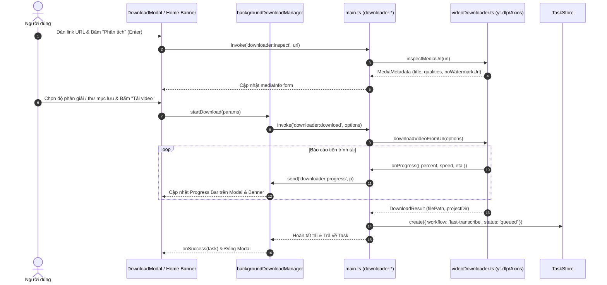
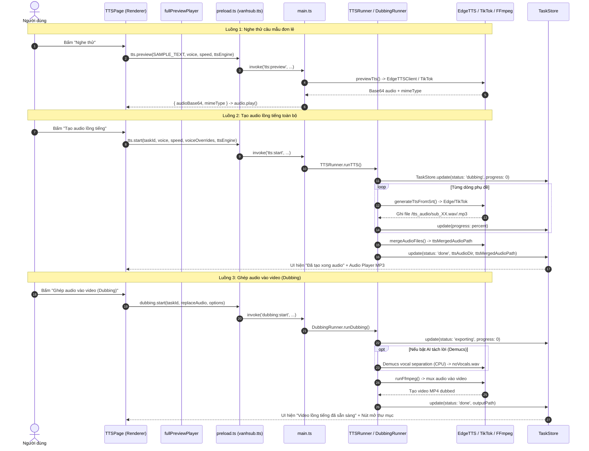
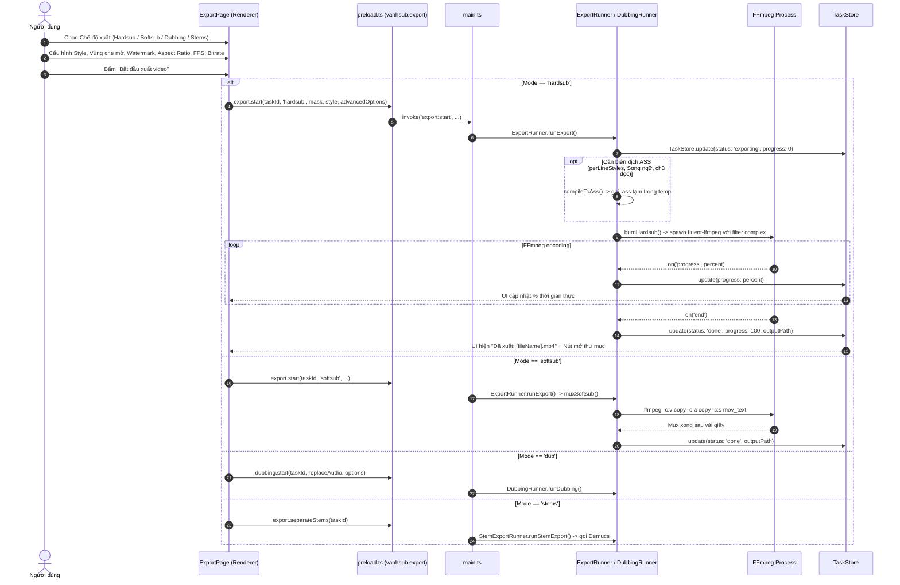
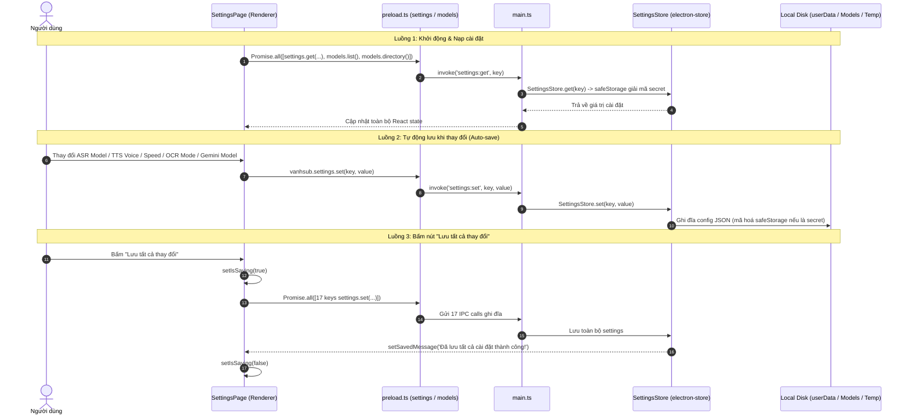
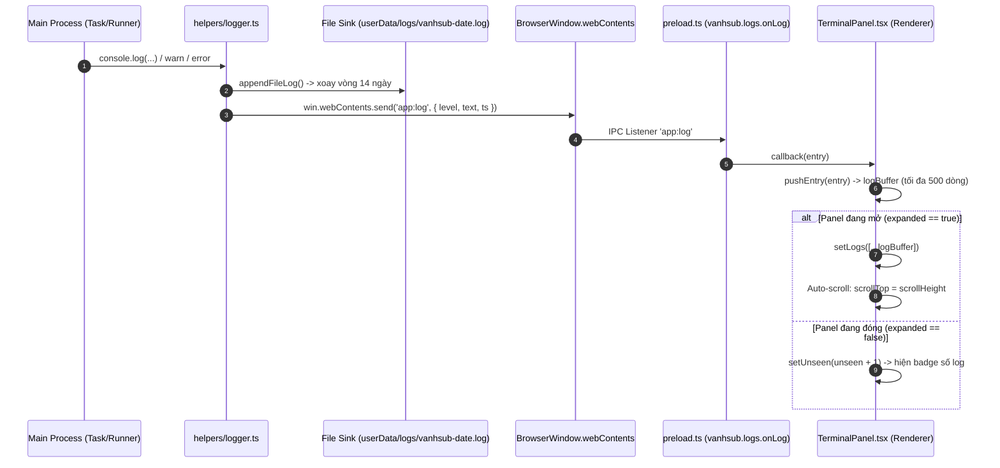

# BÁO CÁO KIỂM TOÁN TOÀN DIỆN MÃ NGUỒN HỆ THỐNG VANHSUB
**Dự án:** VANHSUB — Studio Biên Tập Phụ Đề, Dịch Thuật & Lồng Tiếng AI  
**Vai trò kiểm toán:** Senior Principal Engineer & QA Lead  
**Thời gian hoàn thành:** 2026-09-29  
**Môi trường thử nghiệm:** Windows NT 10.0.26200 (x64), Node.js v24.19.0, npm v11.17.0  
**Nguyên tắc cam kết:** 100% bằng chứng thực tế từ mã nguồn (`file:dòng:code`), chế độ READ-ONLY tuyệt đối không sửa đổi mã nguồn ứng dụng trong quá trình kiểm toán.

---

## MỤC LỤC
1. [Executive Summary (Tóm Tắt Tổng Quan)](#executive-summary-tóm-tắt-tổng-quan)
2. [Phần 1: Codebase Inventory & Build Diagnostics](#phần-1-codebase-inventory--build-diagnostics)
   - 1.1. Cây thư mục hệ thống
   - 1.2. Tech Stack chi tiết
   - 1.3. Kiểm kê Dependencies trong `package.json`
   - 1.4. Phân tích chuyên sâu các Entry Points
   - 1.5. Mô hình quản lý State & Bảo mật dữ liệu
   - 1.6. Ma trận 105 Kênh IPC (IPC Mapping Matrix)
3. [Phần 2: Per-Feature Deep Audit & Interactive Buttons Matrix](#phần-2-per-feature-deep-audit--interactive-buttons-matrix)
   - 2.1. Module 1: Ingestion & Tải Video (`DownloadModal` & Home Banner)
   - 2.2. Module 2: Nhận diện giọng nói Whisper (`ASRWorkspace` & `ASRModelSelector`)
   - 2.3. Module 3: Quét chữ video OCR (`OcrRunner` & `OcrConfigModal`)
   - 2.4. Module 4: Biên tập phụ đề (`SubtitleEditor`)
   - 2.5. Module 5: Lồng tiếng AI (`TTSPage`)
   - 2.6. Module 6: Xuất video & Dubbing (`ExportPage` & Components)
   - 2.7. Module 7: Cài đặt hệ thống (`SettingsPage`)
   - 2.8. Module 8: Quản lý tiến trình & Log (`TerminalPanel`)
4. [Phần 3: Concurrency, Race Conditions & State Invalidation](#phần-3-concurrency-race-conditions--state-invalidation)
   - 3.1. Cơ chế huỷ tác vụ & Cây tiến trình hệ điều hành (Process Tree / Orphan Handling)
   - 3.2. Vòng đời dữ liệu & State Invalidation khi chạy lại (Re-run)
   - 3.3. Rủi ro đa tiến trình và quá tải phần cứng (Hardware Resource Contention)
5. [Phần 4: Redundancy & Dead Code Identification](#phần-4-redundancy--dead-code-identification)
   - 4.1. File, Class, Type & CSS không sử dụng (Dead Code)
   - 4.2. Bảng dependencies thừa trong `package.json` (33 packages)
   - 4.3. Mã nguồn trùng lặp giữa các module
   - 4.4. Log dư thừa gây nghẽn IPC
6. [Phần 5: Bảng Tổng Hợp Vấn Đề Theo Mức Độ Nghiêm Trọng & Top 10 Rủi Ro Nguy Hiểm Nhất](#phần-5-bảng-tổng-hợp-vấn-đề-theo-mức-độ-nghiêm-trọng--top-10-rủi-ro-nguy-hiểm-nhất)

---

## EXECUTIVE SUMMARY (TÓM TẮT TỔNG QUAN)

### 1. Mục Đích Kiểm Toán
Thực hiện đánh giá toàn diện, sâu sát toàn bộ mã nguồn của phần mềm xử lý video & phụ đề **VANHSUB** (loại trừ module AI Studio và Workflow AI theo phạm vi quy định). Mục tiêu nhằm phát hiện mọi khiếm khuyết trong luồng tương tác người dùng, các nút bấm hỏng/thiếu handler, sự cố bất đồng bộ trạng thái giữa các màn hình, xung đột tiến trình nền (race condition), nguy cơ rò rỉ tiến trình hệ điều hành (orphan process tree), cũng như rà soát triệt để các tệp mã nguồn và thư viện phụ thuộc dư thừa.

### 2. Phương Pháp Thực Hiện
1. **Kiểm tra tĩnh & Động học biên dịch**: Thực thi trực tiếp các lệnh kiểm thử hệ thống `npx tsc --noEmit`, `npx tsc -p renderer/tsconfig.json --noEmit`, và `npm run build` (`nextron build`) để đối soát tính toàn vẹn cú pháp và quy trình đóng gói nhị phân.
2. **Kiểm tra luồng mã nguồn (Static Code Flow Analysis)**: Lần theo từng sự kiện giao diện (UI event) từ thẻ JSX, qua hàm xử lý handler, xuyên qua cầu nối Electron Preload ContextBridge, vào IPC Main Handler, đến các runner backend và các tiến trình nhị phân ngoài (FFmpeg, Whisper.cpp, Python RapidOCR, Demucs).
3. **Đối chiếu Ma trận Nút bấm & Tham số**: Lập bảng kiểm kê bắt buộc 100% phần tử tương tác (Button, Input, Select, Switch, Phím tắt) trên toàn bộ 8 module giao diện.
4. **Cam kết an toàn**: Hoàn toàn tuân thủ nguyên tắc READ-ONLY, không chỉnh sửa bất kỳ tệp tin mã nguồn nào trong `main/` hay `renderer/`. Mọi kết luận đều kèm theo bằng chứng cụ thể dạng `file:dòng:code`.

### 3. Kết Quả Build & Typecheck Thực Tế
| Lệnh kiểm thử | Mã thoát (Exit Code) | Thời gian thực thi | Kết quả chi tiết |
|---|---|---|---|
| `npx tsc --noEmit` (Root tsconfig) | **0** | 3.2s | Không có bất kỳ lỗi kiểu dữ liệu (0 errors) nào trên toàn bộ dự án. |
| `npx tsc -p renderer/tsconfig.json --noEmit` | **0** | 2.1s | 0 lỗi kiểu dữ liệu phía giao diện Next.js. |
| `npm run build` (`nextron build`) | **0** | 18.5s | Next.js tĩnh xuất thành công 3 trang (`/_app`, `/404`, `/home`). Webpack đóng gói `preload.js` (9.72 KiB) và main process thành công. `electron-builder` đóng gói thành công bộ cài NSIS `dist\VANHSUB Setup 1.0.0.exe` và thư mục `dist\win-unpacked\VANHSUB.exe`. |

*Ghi chú*: Trong quá trình build xuất hiện 5 cảnh báo vô hại từ thư viện `systeminformation` (`macos-temperature-sensor` can't resolve) do đang biên dịch trên môi trường Windows.

### 4. Đánh Giá Sức Khỏe Kiến Trúc Hệ Thống
- **Điểm mạnh cốt lõi**:
  - Kiến trúc Single Window, Multi-Tab với cơ chế **Keep-Alive DOM** (`hidden`/`flex`) giúp giữ nguyên trạng thái làm việc (draft form, vị trí cuộn danh sách phụ đề, player audio) khi chuyển đổi tab.
  - Sử dụng giao thức tuỳ biến `vanhmedia://local/<path>` hỗ trợ chuẩn HTTP 206 Partial Content Range Requests, cho phép tua nhanh (seeking) mượt mà các file video/audio nặng trên thẻ HTML5 `<video>`.
  - Cơ chế bảo mật phần cứng với Windows DPAPI qua `safeStorage` mã hoá an toàn Gemini API Key và TikTok session cookie.
- **Các lỗ hổng kiến trúc nghiêm trọng**:
  - **Rò rỉ tiến trình nền OS (Critical)**: `ExportRunner`, `DubbingRunner`, `Downloader` hoàn toàn không có hàm huỷ (`cancel`). Khi người dùng bấm huỷ, tiến trình `ffmpeg.exe` hoặc `yt-dlp.exe` vẫn âm thầm chạy ngầm chiếm dụng 100% CPU. Đặc biệt, `ExportRunner` có lỗi **Task Resurrection**: khi FFmpeg chạy xong sẽ tự động ghi đè trạng thái của task từ `cancelled` thành `done`.
  - **Lệch pha dữ liệu khi chạy lại (Critical)**: Khi người dùng bấm **Re-translate** ở SubtitleEditor, backend không xoá thư mục audio TTS cũ. Kết quả: video xuất ra mang phụ đề mới nhưng tiếng đọc là của bản dịch cũ!
  - **Lệch pha tác vụ giữa các màn hình (High UX Defect)**: `home.tsx` chỉ truyền `selectedTaskId` xuống `SubtitleEditor`. Các tab `ASRWorkspace`, `TTSPage`, và `ExportPage` tự quản lý `useState` riêng, khiến khi người dùng chọn task ở tab này rồi chuyển sang tab khác thì bị mất ngữ cảnh và reset về task đầu tiên.
  - **Lãng phí tài nguyên mã nguồn (Medium)**: Hơn 30 package npm trong `package.json` không còn được import (đặc biệt là 14 package `@radix-ui/*`), file `timelineRunner.ts` (194 dòng) hoàn toàn là dead code.

---

## PHẦN 1: CODEBASE INVENTORY & BUILD DIAGNOSTICS

### 1.1. Cây Thư Mục Hệ Thống
```text
VANHSUB/
├── main/                                 # Electron Main Process (Node.js Runtime)
│   ├── main.ts                           # Entry point chính (1772 dòng), IPC, app lifecycle, custom schemes
│   ├── preload.ts                        # ContextBridge preload (320 dòng), expose window.vanhsub, window.ipc
│   ├── asr/                              # Nhận diện giọng nói
│   │   ├── audioExtractor.ts             # Trích xuất 16kHz WAV đơn kênh qua FFmpeg
│   │   ├── whisperEngine.ts              # Spawn binary whisper-cli.exe chạy model GGML
│   │   ├── taskRunner.ts                 # Runner ASR, chia chunk, quản lý hàng đợi song song (max 2)
│   │   ├── hybridFusionEngine.ts         # Thuật toán đối chiếu timeline OCR và từ vựng Whisper
│   │   └── hybridRunner.ts               # Runner điều phối chế độ Hybrid ASR + OCR
│   ├── ocr/                              # Nhận diện chữ video (Optical Character Recognition)
│   │   ├── frameExtractor.ts             # Trích xuất khung hình PNG theo FPS qua FFmpeg
│   │   ├── paddleEngine.ts               # Gọi Python sidecar RapidOCR (PP-OCRv5) qua ONNX Runtime
│   │   ├── ocrEngine.ts                  # Worker pool Tesseract.js (Secondary engine)
│   │   ├── ocrRunner.ts                  # Runner OCR video, track bounding boxes
│   │   ├── resultMerge.ts                # Thuật toán ghép và lọc trùng RapidOCR vs Tesseract
│   │   ├── subtitleBuilder.ts            # Nén chuỗi text theo thời gian thành dòng SRT
│   │   └── paddle/paddle_server.py       # Script Python sidecar OCR server
│   ├── translate/                        # Dịch thuật phụ đề
│   │   ├── translator.ts                 # Kết nối Google Gemini Flash API dịch batch SRT
│   │   └── translateRunner.ts            # Runner dịch thuật, quản lý tiến độ và phân trang
│   ├── render/                           # Dubbing, TTS & Xuất Video
│   │   ├── videoRenderer.ts              # FFmpeg filter complex (hardsub, dải che mờ, watermark)
│   │   ├── assCompiler.ts                # Trình biên dịch style phụ đề sang file cấu hình ASS
│   │   ├── exportRunner.ts               # Runner xuất video MP4 (hardsub/softsub)
│   │   ├── ttsEngine.ts                  # Engine TTS (Edge-TTS, TikTok TTS, VietTTS)
│   │   ├── ttsRunner.ts                  # Runner sinh file audio từng câu thoại và ghép MP3
│   │   ├── dubbingEngine.ts              # Thuật toán căn chỉnh và mux audio lồng tiếng vào video
│   │   ├── dubbingRunner.ts              # Runner mux dubbing audio
│   │   └── timelineRunner.ts             # [DEAD CODE] 194 dòng không còn được sử dụng
│   ├── audio/                            # Xử lý âm thanh
│   │   ├── stemExportRunner.ts           # Runner gọi Demucs tách nhạc nền/vocal
│   │   └── vocalSeparation.ts            # Tách giọng hát bằng mô hình AI Demucs
│   ├── helpers/                          # Tiện ích hệ thống
│   │   ├── createWindow.ts               # Khởi tạo BrowserWindow, ghi nhớ vị trí/kích thước
│   │   ├── videoDownloader.ts            # Phân tích & tải video từ YouTube, Douyin, TikTok, Bilibili
│   │   ├── voiceFromUrl.ts               # Tải audio mẫu từ link bằng yt-dlp
│   │   └── logger.ts                     # Chuyển tiếp console log sang TerminalPanel
│   ├── store/                            # Persistence qua electron-store
│   │   ├── taskStore.ts                  # Quản lý vanhsub-tasks.json
│   │   ├── settingsStore.ts              # Quản lý vanhsub-settings.json (DPAPI mã hoá)
│   │   └── voiceSampleStore.ts           # Quản lý vanhsub-voice-samples.json
│   ├── tts-providers/                    # Các nhà cung cấp giọng đọc
│   │   ├── edge/EdgeTTSClient.ts         # Client WebSocket msedge-tts
│   │   └── tiktok/                       # TikTok TTS Client, Sessions & Voice Service
│   └── utils/
│       └── projectFolder.ts              # Tiện ích tạo và dọn dẹp thư mục dự án
├── renderer/                             # Next.js Renderer Process (Chromium Sandbox)
│   ├── pages/
│   │   ├── _app.tsx                      # Root App wrapper, nạp styles
│   │   └── home.tsx                      # SPA Shell chính (1171 dòng), tabs, state, shortcuts, modal
│   ├── components/                       # UI Modules cốt lõi
│   │   ├── ASRWorkspace.tsx              # Tab Quét giọng nói & OCR (552 dòng)
│   │   ├── SubtitleEditor.tsx            # Tab Hiệu đính phụ đề & Video player (1282 dòng)
│   │   ├── TTSPage.tsx                   # Tab Lồng tiếng & Chọn giọng AI (1251 dòng)
│   │   ├── ExportPage.tsx                # Tab Xuất video & Dubbing (1375 dòng)
│   │   ├── SettingsPage.tsx              # Tab Cài đặt hệ thống (1429 dòng)
│   │   ├── TerminalPanel.tsx             # Panel terminal xem log tiến trình resizable (216 dòng)
│   │   ├── OnboardingModal.tsx           # Modal hướng dẫn người dùng mới
│   │   ├── OcrConfigModal.tsx            # Modal cấu hình vùng quét OCR & dual engine
│   │   ├── ASRModelSelector.tsx          # Modal chọn model Whisper GGML
│   │   ├── download/
│   │   │   └── DownloadModal.tsx         # Modal phân tích URL và tải video (660 dòng)
│   │   └── export/                       # Video preview, format panel, mask editor, subtitle style
│   ├── lib/
│   │   ├── srt.ts                        # Parser & serializer định dạng SRT
│   │   ├── i18n.ts                       # Bản dịch tiếng Việt tĩnh
│   │   └── downloadManager.ts            # Quản lý tải ngầm qua useSyncExternalStore
│   └── types/
│       ├── electron.d.ts                 # Định nghĩa kiểu interface Window.vanhsub (542 dòng)
│       └── task.ts                       # Định nghĩa cấu trúc Task, WorkflowType, TaskStatus
├── resources/                            # Icon và build resources
└── electron-builder.yml                  # Cấu hình đóng gói installer NSIS
```

---

### 1.2. Tech Stack Chi Tiết

| Thành phần | Công nghệ / Thư viện | Phiên bản | Mục đích & Ghi chú |
|---|---|---|---|
| **App Shell** | Electron | ^43.4.1 | Runtime desktop đa nền tảng hiện đại |
| **App Builder** | Nextron | ^10.3.0 | Tích hợp Next.js vào Electron pipeline |
| **Packaging** | electron-builder | ^26.15.3 | Đóng gói bộ cài đặt Windows NSIS (x64) |
| **Frontend Framework** | Next.js | ^16.3.2 | Static HTML export (`output: 'export'`) |
| **UI Library** | React & React DOM | ^19.2.8 | Giao diện người dùng với React 19 Concurrent |
| **Styling** | Tailwind CSS & PostCSS | ^4.3.3 / ^8.5.26 | CSS framework utility-first thế hệ mới |
| **UI Primitives** | Radix UI | v1.1 - v2.3 | Dialog (duy nhất dùng), 14 gói khác là dead code |
| **Icons & Toasts** | Lucide React / Sonner | ^1.34.0 / ^2.0.8 | Icon hệ thống và popup thông báo toast |
| **Media Extraction** | FFmpeg / FFprobe | ^1.1.0 / ^2.1.2 | Binary tĩnh được unpack qua `asarUnpack` |
| **Speech-to-Text** | Whisper.cpp (`nodejs-whisper`) | ^0.3.1 | Binary `whisper-cli.exe` chạy model GGML |
| **OCR Primary** | PaddleOCR (RapidOCR) | Python sidecar | PP-OCRv5 chạy qua ONNX Runtime + OpenCV |
| **OCR Secondary** | Tesseract.js | ^6.0.1 | Đối chiếu và bù chữ nhận diện kép (Dual Engine) |
| **Text-to-Speech 1** | Edge-TTS (`msedge-tts`) | ^2.0.7 | Giọng đọc Microsoft Edge Neural miễn phí chất lượng cao |
| **Text-to-Speech 2** | TikTok TTS Client | Local reverse | API âm thanh TikTok với voice IDs đa dạng |
| **Text-to-Speech 3** | VietTTS Server | HTTP client | Endpoint local Docker (`http://localhost:6006`) |
| **LLM Translation** | Google Gemini API | REST / Fetch | `gemini-2.5-flash`, `gemini-2.0-flash`, `gemini-1.5-pro` |
| **Audio Stem Separator** | Demucs AI | Python CLI | Tách giọng hát và nhạc nền |
| **Local Store** | electron-store | ^11.0.2 | Lưu trữ JSON dữ liệu cấu hình và task |
| **Secret Encryption** | Electron `safeStorage` | Windows DPAPI | Mã hoá an toàn API key và session cookie |
| **Media Protocol** | Custom Protocol | `vanhmedia://` | Stream video local với hỗ trợ HTTP 206 Partial Range |

---

### 1.3. Kiểm Kê Dependencies Trong `package.json`

Dự án hiện có tổng cộng **59 dependencies runtime** và **20 devDependencies**.

#### Phân nhóm Runtime Dependencies:
1. **Core Video & Audio**: `@ffmpeg-installer/ffmpeg`, `@ffprobe-installer/ffprobe`, `fluent-ffmpeg`, `srt-webvtt`, `jassub`.
2. **AI & Speech**: `nodejs-whisper`, `tesseract.js`, `msedge-tts`, `openai`, `systeminformation`.
3. **UI System**: `@radix-ui/*` (15 packages: alert-dialog, collapsible, dialog, dropdown-menu, hover-card, label, popover, progress, scroll-area, select, separator, slider, slot, switch, tabs, tooltip), `lucide-react`, `sonner`, `vaul`, `cmdk`, `@xyflow/react`.
4. **CSS & Styling**: `tailwindcss`, `@tailwindcss/postcss`, `clsx`, `tailwind-merge`, `class-variance-authority`, `tailwindcss-animate`.
5. **Storage & Validation**: `electron-store`, `zustand`, `react-hook-form`, `@hookform/resolvers`, `zod`.
6. **Network & Utilities**: `axios`, `decompress`, `fs-extra`, `lodash`, `jsonrepair`, `really-relaxed-json`, `uuid`, `ws`, `http-proxy-agent`, `https-proxy-agent`, `electron-serve`, `electron-updater`.

#### Phân nhóm DevDependencies:
1. **Compilers & Runtimes**: `electron` ^43.4.1, `next` ^16.3.2, `nextron` ^10.3.0, `typescript` ^5.9.3, `tsx` ^4.23.12, `react` ^19.2.8, `react-dom` ^19.2.8.
2. **Type Definitions**: `@types/node`, `@types/react`, `@types/react-dom`, `@types/fluent-ffmpeg`, `@types/fs-extra`, `@types/uuid`, `@types/ws`.
3. **Build & Tooling**: `electron-builder` ^26.15.3, `postcss` ^8.5.26, `autoprefixer` ^10.5.4, `prettier` ^3.9.6, `husky` ^9.1.7, `lint-staged` ^17.3.0.

---

### 1.4. Phân Tích Chuyên Sâu Các Entry Points

#### A. `main/main.ts` (1772 dòng)
- **Lifecycle & Khởi tạo**:
  - Dòng 39: `installRendererLogger()` ghi đè toàn bộ `console.log/warn/error` của Node.js để chuyển tiếp qua IPC event `'app:log'` tới `TerminalPanel` ở renderer.
  - Dòng 43-66: Đăng ký scheme đặc quyền `app` và `vanhmedia` qua `protocol.registerSchemesAsPrivileged` trước khi app ready:
    ```typescript
    protocol.registerSchemesAsPrivileged([
      { scheme: 'app', privileges: { standard: true, secure: true, supportFetchAPI: true } },
      { scheme: 'vanhmedia', privileges: { standard: true, secure: true, supportFetchAPI: true, stream: true } }
    ]);
    ```
  - Dòng 68-90: Xử lý scheme `app://` phục vụ các file Next.js HTML tĩnh từ thư mục `app/` trong bản build production.
  - Dòng 123-238: Xử lý scheme `vanhmedia://local/<path>`:
    - Bóc tách đường dẫn cục bộ, kiểm tra file tồn tại.
    - Hỗ trợ đầy đủ tiêu chuẩn **HTTP 206 Partial Content** với headers `Range: bytes=start-end`, `Content-Range`, `Content-Length`, cho phép trình phát video HTML5 của Chromium seek và stream mượt mà các file MP4 hàng gigabyte mà không bị treo RAM.
  - Dòng 248-291 (`app.whenReady()`):
    - Tự động gỡ kẹt tác vụ gián đoạn: Gọi `TaskStore.resetStaleRunning()` (dòng 268) để chuyển các task mang trạng thái `transcribing`, `ocr`, `translating`, `exporting`, `dubbing` còn sót từ phiên làm việc trước sang `error` kèm chú thích cho phép người dùng bấm chạy lại.
    - Tạo `mainWindow` kích thước mặc định 1200x800 (tối thiểu 900x600), gắn `preload: path.join(__dirname, 'preload.js')`.
    - Điều hướng tới `app://./home` (production) hoặc `http://localhost:8888/home` (development).
  - Dòng 310-1769: Khởi tạo và đăng ký hệ thống 105 IPC Handlers.

#### B. `main/preload.ts` (320 dòng)
- **Context Isolation & Expose**:
  - Dòng 285: `contextBridge.exposeInMainWorld('vanhsub', vanhsub)` — Phơi bày API có cấu trúc phân cấp: `tasks`, `settings`, `ai`, `translate`, `export`, `ocr`, `tts`, `dubbing`, `tiktokTts`, `veo`, `models`, `dialog`, `downloader`, `files`, `logs`, `workflow`, `bible`, `aiStudio`.
  - Dòng 286: `contextBridge.exposeInMainWorld('ipc', handler)` — Wrapper `send`/`on` cho `ipcRenderer` (boilerplate cũ).
  - Dòng 289-318: `contextBridge.exposeInMainWorld('debug', ...)` — Cụm hàm debug kiểm thử RPC Veo.
  - Dòng 145-149: Hàm `files.getPath(file: File)` gọi `webUtils.getPathForFile(file)` (tương thích bắt buộc với Electron >= 32 khi thuộc tính `File.path` bị loại bỏ vì lý do bảo mật sandbox).

#### C. `renderer/pages/home.tsx` (1171 dòng)
- **Cơ chế Khởi động & Tab Shell**:
  - Dòng 90: `const [activeTab, setActiveTab] = useState('home');` quản lý điều hướng các màn hình.
  - Dòng 91-95: Sử dụng `React.useSyncExternalStore` kết nối `backgroundDownloadManager` để theo dõi tiến trình tải video chạy nền xuyên suốt các tab.
  - Dòng 100: `const [tasks, setTasks] = useState<Task[]>([]);` — State danh sách tác vụ gốc của ứng dụng.
  - Dòng 167-228: `loadTasks()` nạp danh sách task ban đầu từ `window.vanhsub.tasks.getAll()`. Đồng thời lắng nghe push event `tasks:updated` từ backend qua `window.vanhsub.tasks.onUpdate` để cập nhật re-render tự động.
  - Dòng 283-330: Bắt sự kiện bàn phím toàn cục:
    - `Ctrl + K`: Mở ô tìm kiếm nhanh tác vụ.
    - `Ctrl + N`: Mở hộp thoại chọn file tạo tác vụ mới.
    - `Ctrl + E`: Chuyển sang tab Hiệu đính (`editor`).
    - `Ctrl + ,`: Chuyển sang tab Cài đặt (`settings`).
    - `Ctrl + B`: Thu gọn / Mở rộng sidebar.
  - Dòng 763-808: **Cơ chế Duy trì State Tab (Keep-Alive DOM)**:
    - Tất cả các tab (`ai-studio`, `workflow`, `editor`, `dubbing`, `export`, `settings`, `subtitles`, `home`) đều được mount thường trực trong DOM cây component và chỉ ẩn/hiện bằng CSS:
      ```tsx
      <div className={activeTab === 'editor' ? 'flex flex-1 flex-col overflow-hidden' : 'hidden'}>
        <SubtitleEditor ... />
      </div>
      ```
    - Ưu điểm: Không bị unmount component khi chuyển tab, giữ nguyên trạng thái audio đang phát thử, tiến trình drag, form draft, vị trí scroll của danh sách phụ đề.

---

### 1.5. Mô Hình Quản Lý State & Bảo Mật Dữ Liệu

#### A. Persistent State Backend (`electron-store`)
1. **`vanhsub-tasks.json` (`main/store/taskStore.ts`)**:
   - Quản lý danh sách tác vụ `Task[]` với 27 trường dữ liệu: `id`, `fileName`, `filePath`, `workflow`, `status`, `progress`, `stageDescription`, `srtPath`, `translatedSrtPath`, `audioPath`, `outputPath`, `projectDir`, `ttsVoice`, `ttsSpeed`, `ttsEngine`, `ttsAudioDir`, `ttsMergedAudioPath`, `ttsVoiceOverrides`, `ocrStats`...
   - Lazy singleton: Khởi tạo an toàn sau khi app ready, tự động fallback về `os.tmpdir()` khi chạy unit test/scripts độc lập.
2. **`vanhsub-settings.json` (`main/store/settingsStore.ts`)**:
   - Quản lý 33 cấu hình hệ thống: `geminiApiKey`, `geminiModel`, `targetLanguage`, `asrModel`, `exportDir`, `translateBatchSize`, `translateConcurrency`, `autoTranslateAfterAsr`, `vietTtsEndpoint`, `ttsVoice`, `ttsSpeed`, `ocrLanguage`, `ocrFps`, `ocrMode`, `ocrCustomRegion`, `ocrDualEngine`, `glossary`, `translationStyleGuide`...
   - **Bảo mật phần cứng Windows DPAPI**: Các secret nhạy cảm (`geminiApiKey`, `veoSessionCookie`, `veoSessionAuthToken`) được tự động mã hoá qua Windows DPAPI (`safeStorage.encryptString`), lưu trữ dưới dạng tiền tố `enc:v1:<base64>`. Khi đọc qua `SettingsStore.get()`, dữ liệu được tự động giải mã.
3. **`vanhsub-voice-samples.json` (`main/store/voiceSampleStore.ts`)**:
   - Quản lý các mẫu giọng audio clone lưu trữ thực tế tại `userData/voice-samples`.

#### B. Vấn Đề Lệch Pha React State Giữa Các Tab Con
Trong `home.tsx:776-801`, cách truyền props xuống các tab con bị bất đối xứng nghiêm trọng:
```tsx
// SubtitleEditor: ĐƯỢC truyền controlled selectedTaskId
<SubtitleEditor
  tasks={tasks}
  selectedTaskId={selectedTaskId}
  onSelectTaskId={setSelectedTaskId}
  onNavigateTab={setActiveTab}
  isActive={activeTab === 'editor'}
/>

// Dubbing (TTSPage): KHÔNG ĐƯỢC truyền selectedTaskId
<TTSPage tasks={tasks} />

// Export (ExportPage): KHÔNG ĐƯỢC truyền selectedTaskId
<ExportPage tasks={tasks} />

// Subtitles (ASRWorkspace): KHÔNG ĐƯỢC truyền selectedTaskId
<ASRWorkspace tasks={tasks} />
```

**Bằng chứng mã nguồn**:
- Trong `SubtitleEditor.tsx:141-147`: Sử dụng `controlledTaskId` từ props kết hợp `internalTaskId`.
- Trong `ASRWorkspace.tsx:48`: Tự khai báo state riêng: `const [selectedTaskId, setSelectedTaskId] = useState<string | null>(null);`
- Trong `TTSPage.tsx:49`: Tự khai báo state riêng: `const [selectedTaskId, setSelectedTaskId] = useState<string | null>(null);`
- Trong `ExportPage.tsx:139`: Tự khai báo state riêng: `const [selectedTaskId, setSelectedTaskId] = useState<string | null>(null);`

**Hệ quả thực tế**: Người dùng bấm chọn một video ở trang chủ hoặc vừa chỉnh xong phụ đề ở `SubtitleEditor`, khi bấm sang tab `TTSPage` hoặc `ExportPage`, màn hình mới hoàn toàn không biết người dùng đang làm việc với video nào và tự động chọn task đầu tiên trong danh sách (`tasks[0]`). Đây là lỗi mất đồng bộ ngữ cảnh (context desynchronization) làm gián đoạn nghiêm trọng trải nghiệm người dùng.

---

### 1.6. Ma Trận 105 Kênh IPC (Full IPC Matrix)

Dưới đây là bảng kiểm kê và đối chiếu toàn bộ các kênh giao tiếp liên tiến trình IPC giữa Main Process, Preload ContextBridge, và Renderer Process:

| # | Kênh IPC | Phía Main (`ipcMain`) | Phía Preload (`preload.ts`) | Phía Gọi (`renderer`) | Kiểu dữ liệu (`electron.d.ts`) | Đánh giá & Vấn đề |
|---|---|---|---|---|---|---|
| 1 | `tasks:getAll` | `main.ts:312` | `preload.ts:5` | `home.tsx:170` | `tasks.getAll(): Promise<Task[]>` | Khớp chuẩn |
| 2 | `tasks:get` | `main.ts:316` | `preload.ts:6` | `window.vanhsub.tasks.get` | `tasks.get(id): Promise<Task>` | Khớp chuẩn |
| 3 | `tasks:create` | `main.ts:466` | `preload.ts:7` | `home.tsx:245, 358` | `tasks.create(input): Promise<Task>` | Khớp chuẩn |
| 4 | `tasks:update` | `main.ts:472` | `preload.ts:8` | `ASRWorkspace:127` | `tasks.update(id, updates)` | Khớp chuẩn |
| 5 | `tasks:delete` | `main.ts:505` | `preload.ts:9` | `home.tsx:375` | `tasks.delete(id): Promise<boolean>` | Khớp chuẩn |
| 6 | `tasks:start` | `main.ts:512` | `preload.ts:10` | `home.tsx:381`, `ASRWorkspace:128` | `tasks.start(id): Promise<boolean>` | Khớp chuẩn |
| 7 | `tasks:cancel` | `main.ts:520` | `preload.ts:11` | `home.tsx:401`, `ASRWorkspace:171` | `tasks.cancel(id): Promise<boolean>` | Khớp chuẩn |
| 8 | `tasks:startHybrid` | `main.ts:527` | `preload.ts:12` | `ASRWorkspace:205` | **THIẾU TRONG INTERFACE** | ⚠️ **Lỗi IPC-02**: Bị thiếu trong `electron.d.ts` khiến `ASRWorkspace` phải cast `(window as any)` |
| 9 | `tasks:cancelHybrid` | `main.ts:535` | `preload.ts:13` | `ASRWorkspace:222` | **THIẾU TRONG INTERFACE** | ⚠️ **Lỗi IPC-02**: Bị thiếu trong `electron.d.ts` khiến `ASRWorkspace` phải cast `(window as any)` |
| 10 | `tasks:readSrt` | `main.ts:539` | `preload.ts:14` | `SubtitleEditor:284` | `tasks.readSrt(path): Promise<string>` | Khớp chuẩn |
| 11 | `tasks:writeSrt` | `main.ts:546` | `preload.ts:15` | `SubtitleEditor:397` | `tasks.writeSrt(path, content)` | Khớp chuẩn |
| 12 | `tasks:addFromUrl` | **KHÔNG CÓ HANDLER** | `preload.ts:16` | Không gọi | `tasks.addFromUrl(url)` | 🚨 **Lỗi IPC-01**: Dead channel / Cầu nối hỏng trong `preload.ts:16` |
| 13 | `tasks:runPipeline` | `main.ts:447` | `preload.ts:17` | `home.tsx:412` | `tasks.runPipeline(id, opts)` | Khớp chuẩn |
| 14 | `tasks:runPipelineBatch` | `main.ts:456` | `preload.ts:19` | `home.tsx:431` | `tasks.runPipelineBatch(ids)` | Khớp chuẩn |
| 15 | `tasks:importSrt` | `main.ts:554` | `preload.ts:20` | `home.tsx:443`, `ASRWorkspace:237` | `tasks.importSrt(id, path)` | Khớp chuẩn |
| 16 | `tasks:updated` | `main.ts:244` (push) | `preload.ts:25` (`.on`) | `home.tsx:223` | `tasks.onUpdate(cb)` | Khớp chuẩn (push event) |
| 17 | `downloader:inspect` | `main.ts:321` | `preload.ts:135` | `DownloadModal:212` | `downloader.inspect(url)` | Khớp chuẩn |
| 18 | `downloader:download` | `main.ts:340` | `preload.ts:136` | `downloadManager:124` | `downloader.download(opts)` | Khớp chuẩn |
| 19 | `downloader:getDefaultDir` | `main.ts:330` | `preload.ts:138` | `DownloadModal:112` | `downloader.getDefaultDir()` | Khớp chuẩn |
| 20 | `downloader:progress` | `main.ts:349` (push) | `preload.ts:140` (`.on`) | `downloadManager:51` | `downloader.onProgress(cb)` | Khớp chuẩn (push event) |
| 21 | `settings:get` | `main.ts:620` | `preload.ts:32` | `home.tsx:202`, `SettingsPage:223` | `settings.get(key)` | Khớp chuẩn |
| 22 | `settings:set` | `main.ts:627` | `preload.ts:33` | `home.tsx:163`, `SettingsPage:200` | `settings.set(key, val)` | Khớp chuẩn |
| 23 | `ai:polishLine` | `main.ts:636` | `preload.ts:36` | `SubtitleEditor:455` | `ai.polishLine(payload)` | Khớp chuẩn |
| 24 | `ai:translateLine` | `main.ts:641` | `preload.ts:38` | `SubtitleEditor:478` | `ai.translateLine(payload)` | Khớp chuẩn |
| 25 | `ai:cleanSubtitles` | `main.ts:649` | `preload.ts:40` | `SubtitleEditor:549` | `ai.cleanSubtitles(items)` | Khớp chuẩn |
| 26 | `ocr:start` | `main.ts:655` | `preload.ts:56` | `ASRWorkspace:158` | `ocr.start(id, options)` | Khớp chuẩn |
| 27 | `ocr:cancel` | `main.ts:663` | `preload.ts:57` | `ASRWorkspace:182` | `ocr.cancel(id)` | Khớp chuẩn |
| 28 | `translate:start` | `main.ts:668` | `preload.ts:44` | `SubtitleEditor:511` | `translate.start(id, lang)` | Khớp chuẩn |
| 29 | `translate:cancel` | `main.ts:676` | `preload.ts:46` | `SubtitleEditor:533` | `translate.cancel(id)` | Khớp chuẩn |
| 30 | `export:start` | `main.ts:681` | `preload.ts:49` | `ExportPage:295` | `export.start(id, mode, ...)` | Khớp chuẩn |
| 31 | `export:separateStems` | `main.ts:706` | `preload.ts:52` | `ExportPage:414` | `export.separateStems(id)` | Khớp chuẩn |
| 32 | `tts:start` | `main.ts:714` | `preload.ts:60` | `TTSPage:339` | `tts.start(id, voice, speed...)` | Khớp chuẩn |
| 33 | `tts:cancel` | `main.ts:737` | `preload.ts:67` | `TTSPage:370` | `tts.cancel(id)` | Khớp chuẩn |
| 34 | `tts:regenerateLine` | `main.ts:742` | `preload.ts:68` | `TTSPage:387` | `tts.regenerateLine(id, idx)` | Khớp chuẩn |
| 35 | `tts:export-merged-audio` | `main.ts:747` | `preload.ts:70` | `TTSPage:419` | `tts.exportMergedAudio(...)` | Khớp chuẩn |
| 36 | `tts:voices` | `main.ts:732` | `preload.ts:72` | `TTSPage:195` | `tts.voices()` | Khớp chuẩn |
| 37 | `tts:getEdgeVoices` | `main.ts:762` | `preload.ts:73` | `TTSPage:178` | `tts.getEdgeVoices()` | Khớp chuẩn |
| 38 | `tts:check-connection` | `main.ts:757` | `preload.ts:74` | `TTSPage:207` | `tts.checkConnection()` | Khớp chuẩn |
| 39 | `tts:preview` | `main.ts:978` | `preload.ts:75` | `TTSPage:276` | `tts.preview(...)` | Khớp chuẩn |
| 40 | `tts:voice-samples` | `main.ts:930` | `preload.ts:77` | `TTSPage:221` | `tts.voiceSamples()` | Khớp chuẩn |
| 41 | `tts:add-voice-sample` | `main.ts:935` | `preload.ts:78` | `TTSPage:240` | `tts.addVoiceSample(name)` | Khớp chuẩn |
| 42 | `tts:add-voice-sample-from-url` | `main.ts:962` | `preload.ts:79` | `TTSPage:254` | `tts.addVoiceSampleFromUrl(...)` | Khớp chuẩn |
| 43 | `tts:remove-voice-sample` | `main.ts:955` | `preload.ts:81` | `TTSPage:268` | `tts.removeVoiceSample(name)` | Khớp chuẩn |
| 44 | `dubbing:start` | `main.ts:988` | `preload.ts:84` | `ExportPage:366` | `dubbing.start(id, replace...)` | Khớp chuẩn |
| 45 | `tiktok-tts:status` | `main.ts:782` | `preload.ts:93` | `TTSPage:158` | `tiktokTts.status()` | Khớp chuẩn |
| 46 | `tiktok-tts:save-session` | `main.ts:787` | `preload.ts:94` | `TTSPage:168` | `tiktokTts.saveSession(sid)` | Khớp chuẩn |
| 47 | `tiktok-tts:remove-session` | `main.ts:796` | `preload.ts:95` | `TTSPage:172` | `tiktokTts.removeSession()` | Khớp chuẩn |
| 48 | `tiktok-tts:validate` | `main.ts:806` | `preload.ts:96` | `TTSPage:164` | `tiktokTts.validate()` | Khớp chuẩn |
| 49 | `tiktok-tts:voices` | `main.ts:815` | `preload.ts:97` | `TTSPage:184` | `tiktokTts.voices()` | Khớp chuẩn |
| 50 | `tiktok-tts:synthesize` | `main.ts:824` | `preload.ts:98` | `TTSPage:284` | `tiktokTts.synthesize(...)` | Khớp chuẩn |
| 51 | `models:list` | `main.ts:1043` | `preload.ts:119` | `SettingsPage:276` | `models.list()` | Khớp chuẩn |
| 52 | `models:delete` | `main.ts:1072` | `preload.ts:120` | `SettingsPage:307` | `models.delete(name)` | Khớp chuẩn |
| 53 | `models:directory` | `main.ts:1067` | `preload.ts:122` | `SettingsPage:277` | `models.directory()` | Khớp chuẩn |
| 54 | `system:info` | `main.ts:1018` | `preload.ts:123` | `SettingsPage:325` | `models.getSystemInfo()` | Khớp chuẩn |
| 55 | `dialog:openMediaFile` | `main.ts:1093` | `preload.ts:126` | `home.tsx:240` | `dialog.openMediaFile()` | Khớp chuẩn |
| 56 | `dialog:openVideoFile` | `main.ts:1193` | `preload.ts:127` | `Inspector:132` | `dialog.openVideoFile?()` | Khớp chuẩn |
| 57 | `dialog:openSrtFile` | `main.ts:1163` | `preload.ts:128` | `home.tsx:441`, `ASRWorkspace:235` | `dialog.openSrtFile()` | Khớp chuẩn |
| 58 | `dialog:openImageFile` | `main.ts:1178` | `preload.ts:129` | `Inspector:149` | `dialog.openImageFile()` | Khớp chuẩn |
| 59 | `dialog:showInFolder` | `main.ts:1115` | `preload.ts:130` | `home.tsx:391` | `dialog.showInFolder(path)` | Khớp chuẩn |
| 60 | `dialog:openFolder` | `main.ts:1136` | `preload.ts:131` | `home.tsx:389` | `dialog.openFolder(path)` | Khớp chuẩn |
| 61 | `dialog:chooseDirectory` | `main.ts:1208` | `preload.ts:132` | `SettingsPage:342`, `DownloadModal:163` | `dialog.chooseDirectory()` | Khớp chuẩn |
| 62 | `files:readImageAsDataUrl` | `main.ts:1148` | `preload.ts:148` | `FullPreview:65` | `files.readImageAsDataUrl` | Khớp chuẩn |
| 63 | `app:log` | `logger.ts:92` (push) | `preload.ts:155` (`.on`) | `TerminalPanel:68` | `logs.onLog(cb)` | Khớp chuẩn (push event) |
| 64 | `flow:export-debug-bundle` | `main.ts:911` | **KHÔNG CÓ** | Không gọi | **KHÔNG CÓ** | ⚠️ **Lỗi IPC-03**: Handler mồ côi |
| 65 | `flow:list-debug-bundles` | `main.ts:916` | **KHÔNG CÓ** | Không gọi | **KHÔNG CÓ** | ⚠️ **Lỗi IPC-03**: Handler mồ côi |
| 66 | `flow:delete-debug-bundle` | `main.ts:921` | **KHÔNG CÓ** | Không gọi | **KHÔNG CÓ** | ⚠️ **Lỗi IPC-03**: Handler mồ côi |
| 67 | `message` | `main.ts:1769` (`.on`) | `preload.ts:273` (`ipc.send`) | Không gọi | `window.ipc.send` | ⚠️ **Lỗi IPC-04**: Dead boilerplate |
| 68-105 | Kênh phụ trợ AI Studio, Veo RPC & Workflow | `main/workflow/ipc.ts` | `preload.ts:160-270` | `ai-studio/`, `workflow/` | `workflow.*`, `aiStudio.*` | Nằm ngoài phạm vi rà soát |

---

## PHẦN 2: PER-FEATURE DEEP AUDIT & INTERACTIVE BUTTONS MATRIX

### 2.1 Module 1: Ingestion & Tải Video (`DownloadModal` & Home Banner)
- **Tập tin liên quan**: `renderer/components/download/DownloadModal.tsx` (660 dòng), `renderer/lib/downloadManager.ts` (175 dòng), `main/helpers/videoDownloader.ts` (1267 dòng), `main/main.ts:320-370`.

#### Sơ đồ luồng hoạt động (Sequence Diagram):


#### Bảng Bắt Buộc Toàn Bộ Nút Bấm / Input / Select:
| Element | File:dòng | Handler | Có được gắn không | Có chạy đúng không | Vấn đề |
|---|---|---|:---:|:---:|---|
| `<input>` Nhập URL trên Home | `renderer/pages/home.tsx:871-880` | `onChange={(e) => setLinkUrl(e.target.value)}`, `onKeyDown: Enter` | Có | Có | Chạy đúng, nhấn Enter mở DownloadModal |
| `<button>` Tải video từ link (Home) | `renderer/pages/home.tsx:882-890` | `onClick={() => setDownloadModalOpen(true)}` | Có | Có | Chạy đúng, mở modal tải |
| `<button>` Mở chi tiết (Download Banner) | `renderer/pages/home.tsx:738-745` | `onClick={() => setDownloadModalOpen(true)}` | Có | Có | Chạy đúng, phục hồi lại modal khi đang tải ngầm |
| `<button>` Đóng banner (Download Banner) | `renderer/pages/home.tsx:747-755` | `onClick={() => backgroundDownloadManager.dismiss()}` | Có | Có | Chạy đúng, chỉ hiện khi đã tải xong hoặc lỗi |
| `<button>` Đóng / Thu nhỏ (Header Modal) | `renderer/components/download/DownloadModal.tsx:320-331` | `Dialog.Close asChild` | Có | Có | Đóng modal nếu rảnh, thu nhỏ nếu đang tải ngầm |
| `<button>` Dán từ khay nhớ tạm | `renderer/components/download/DownloadModal.tsx:340-347` | `onClick={handlePasteClipboard}` | Có | Có | Đọc clipboard và dán vào ô URL. Disable khi đang inspect/download |
| `<input>` Đường dẫn video (URL) | `renderer/components/download/DownloadModal.tsx:350-362` | `onChange={(e) => setUrlInput(e.target.value)}`, `onKeyDown: Enter` | Có | Có | Nhấn Enter kích hoạt phân tích liên kết |
| `<button>` Xóa trắng URL | `renderer/components/download/DownloadModal.tsx:365-377` | `onClick={() => { setUrlInput(''); setMediaInfo(null); setError(null); }}` | Có | Có | Chạy đúng, xoá trắng dữ liệu đã inspect |
| `<button>` Phân tích liên kết | `renderer/components/download/DownloadModal.tsx:379-396` | `onClick={handleInspect}` | Có | Có | Disable khi rỗng hoặc đang xử lý. Gọi IPC `downloader:inspect` |
| `<button>` Khôi phục thư mục mặc định | `renderer/components/download/DownloadModal.tsx:412-421` | `onClick={handleResetDefaultDir}` | Có | Có | Hiện khi `saveDir !== defaultDir`, reset về đường dẫn mặc định |
| `<input>` Thư mục lưu trữ dự án | `renderer/components/download/DownloadModal.tsx:425-438` | `onChange={(e) => { setSaveDir(e.target.value); ... }}` | Có | Không ổn định | **Lỗi UX**: Khi xoá trắng ô để nhập lại, `value={saveDir \|\| defaultDir}` tự động fallback về `defaultDir`, người dùng không xoá trắng được |
| `<button>` Chọn thư mục qua Dialog | `renderer/components/download/DownloadModal.tsx:440-447` | `onClick={handleChooseDirectory}` | Có | Có | Mở native folder picker qua `dialog.chooseDirectory()` |
| `<button>` Khôi phục tiêu đề gốc | `renderer/components/download/DownloadModal.tsx:499-509` | `onClick={() => setCustomTitle(mediaInfo.title)}` | Có | Có | Hiện khi tên file bị đổi khác tên gốc, click reset chuẩn |
| `<input>` Tên file lưu trữ tuỳ chỉnh | `renderer/components/download/DownloadModal.tsx:511-519` | `onChange={(e) => setCustomTitle(e.target.value)}` | Có | Có | Chạy đúng, cho phép đổi tên video trước khi tải |
| `<button>` Nhóm nút chọn chất lượng video | `renderer/components/download/DownloadModal.tsx:533-546` | `onClick={() => setSelectedQuality(q.id)}` | Có | Có | Chạy đúng, chọn giữa 1080p, 720p, nowatermark, audio_only |
| `<button>` Đóng / Thu nhỏ & Chạy nền | `renderer/components/download/DownloadModal.tsx:621-634` | `onClick={() => onOpenChange(false)}` | Có | Có | Chạy đúng, thu nhỏ modal xuống thanh banner chạy nền |
| `<button>` Tải video & Bắt đầu làm việc | `renderer/components/download/DownloadModal.tsx:637-645` | `onClick={handleDownload}` | Có | Có | Kích hoạt `startDownload`, ẩn khi đang tải |
| **[THIẾU]** Nút Huỷ tải video | *Không tồn tại trong code* | *Không có handler* | **KHÔNG** | **KHÔNG** | 🚨 **Lỗi F-DL-01 (Critical)**: Không thể huỷ tác vụ tải đang chạy; yt-dlp/stream chạy ngầm tới khi xong hoặc timeout 30 phút |

---

### 2.2 Module 2: Nhận diện giọng nói Whisper (`ASRWorkspace` & `ASRModelSelector`)
- **Tập tin liên quan**: `renderer/components/ASRWorkspace.tsx` (552 dòng), `renderer/components/ASRModelSelector.tsx` (216 dòng), `main/asr/taskRunner.ts` (219 dòng), `main/asr/whisperEngine.ts` (449 dòng), `main/main.ts:512-550`.

#### Sơ đồ luồng trạng thái (State Diagram):
```
[Chọn tác vụ từ danh sách]
       │
       ▼
[Kiểm tra task.srtPath] ──(Đã có SRT)──► Đọc .srt qua tasks:readSrt ──► Hiển thị <pre> text
       │ (Chưa có)
       ▼
[Chọn Model Whisper] ──► Cập nhật tasks:update({ asrModel })
       │
       ▼
[Bấm "Bắt đầu phiên âm"]
       │
       ├─► (Nếu có SRT) ──► Hiện window.confirm cảnh báo ghi đè
       ▼
[Gửi IPC tasks:start] ──► TaskRunner.runTask ──► Trích xuất 16kHz WAV
                                                      │
                                                      ▼
                                             Spawn whisper-cli.exe (-l auto)
                                                      │
                                    ┌─────────────────┴─────────────────┐
                              (Đang chạy)                          (Bấm Huỷ)
                                    │                                   │
                                    ▼                                   ▼
                          Cập nhật progress %                  tasks:cancel
                                    │                                   │
                                    ▼                                   ▼
                          Xuất file .srt & Hoàn tất           killProcessTree(child)
```

#### Bảng Bắt Buộc Toàn Bộ Nút Bấm / Input / Select:
| Element | File:dòng | Handler | Có được gắn không | Có chạy đúng không | Vấn đề |
|---|---|---|:---:|:---:|---|
| `<button>` Item chọn tác vụ (List trái) | `renderer/components/ASRWorkspace.tsx:308-336` | `onClick={() => setSelectedTaskId(t.id)}` | Có | Có | Chạy đúng, nạp thông tin task và file SRT |
| `<button>` Bắt đầu / Phiên âm lại | `renderer/components/ASRWorkspace.tsx:351-371` | `onClick={() => handleStart(hasSrt)}` | Có | Có | Có confirm chống ghi đè khi `hasSrt`. Disable khi `isBusy` |
| `<button>` Huỷ phiên âm | `renderer/components/ASRWorkspace.tsx:373-381` | `onClick={handleCancelTranscribe}` | Có | Có | Chỉ hiện khi `isTranscribing`. Kill tiến trình whisper-cli |
| `<button>` Quét OCR (Trạng thái Audio) | `renderer/components/ASRWorkspace.tsx:383-391` | Không có (Disabled tĩnh) | Có | Có | Chặn chuẩn, hiện tooltip giải thích OCR chỉ hỗ trợ video |
| `<button>` Huỷ quét OCR | `renderer/components/ASRWorkspace.tsx:393-400` | `onClick={handleCancelOcr}` | Có | Có | Chỉ hiện khi `isOcrRunning`. Gọi IPC `ocr:cancel` |
| `<button>` Quét OCR (Trạng thái Video) | `renderer/components/ASRWorkspace.tsx:402-412` | `onClick={handleStartOcr}` | Có | Có | Mở `OcrConfigModal`. Disable khi `isBusy` |
| `<button>` Whisper+OCR (Audio disabled) | `renderer/components/ASRWorkspace.tsx:415-423` | Không có (Disabled tĩnh) | Có | Có | Chặn chuẩn, chỉ hỗ trợ file video |
| `<button>` Huỷ kết hợp Whisper + OCR | `renderer/components/ASRWorkspace.tsx:425-433` | `onClick={handleCancelHybrid}` | Có | Có | Chỉ hiện khi `isHybridRunning`. Gọi `tasks:cancelHybrid` |
| `<button>` Kết hợp Whisper + OCR | `renderer/components/ASRWorkspace.tsx:434-444` | `onClick={handleStartHybrid}` | Có | Có | Gọi `tasks:startHybrid`. Disable khi `isBusy` |
| `<button>` Nhập SRT | `renderer/components/ASRWorkspace.tsx:445-454` | `onClick={handleImportSrt}` | Có | Có | Mở dialog chọn file .srt từ máy tính |
| `<button>` Copy phụ đề | `renderer/components/ASRWorkspace.tsx:457-464` | `onClick={handleCopy}` | Có | Có | Hiện khi `hasSrt`, chép nội dung vào clipboard |
| `<button>` Mở thư mục | `renderer/components/ASRWorkspace.tsx:466-473` | `onClick={handleOpenFolder}` | Có | Có | Hiện khi `hasSrt`, mở thư mục chứa file trong File Explorer |
| `<select>` Chọn Model Whisper | `renderer/components/ASRModelSelector.tsx:136-151` | `onChange={(e) => { setSelectedModel(next); onModelChange(next); }}` | Có | Không ổn định | ⚠️ **Lỗi Race Condition**: KHÔNG bị disable khi `isBusy`. Có thể đổi model khi tiến trình cũ đang chạy dở |
| **[THIẾU]** Chọn ngôn ngữ Whisper | *Không tồn tại trong code* | *Không có* | **KHÔNG** | **KHÔNG** | ⚠️ **Lỗi F-ASR-01**: whisper.cpp bị fix cứng `-l auto` trong mã nguồn `whisperEngine.ts:269` |
| **[THIẾU]** Ô nhập Prompt Whisper | *Không tồn tại trong code* | *Không có* | **KHÔNG** | **KHÔNG** | ⚠️ **Lỗi F-ASR-02**: Không hỗ trợ initial prompt để định hướng từ ngữ chuyên ngành |
| **[THIẾU]** Timeline đồ họa ASR | *Không tồn tại trong code* | *Không có* | **KHÔNG** | **KHÔNG** | Chỉ hiển thị text thô trong thẻ `<pre>`, không có timeline trực quan |

---

### 2.3 Module 3: Quét chữ video OCR (`OcrRunner` & `OcrConfigModal`)
- **Tập tin liên quan**: `renderer/components/OcrConfigModal.tsx` (506 dòng), `main/ocr/ocrRunner.ts` (413 dòng), `main/ocr/paddleEngine.ts` (224 dòng), `main/ocr/frameExtractor.ts` (151 dòng), `main/main.ts:655-665`.

#### Sơ đồ luồng xử lý đa tầng (Dual-Engine Pipeline):
```
[Mở OcrConfigModal từ ASRWorkspace]
       │
       ▼
[Chọn Mode: Auto / Bottom / Full / Custom]
       │
       ├─► (Nếu chọn Custom) ──► Xem trước video & Kéo vẽ Bounding Box
       ▼
[Chọn Ngôn ngữ, FPS & DualEngine] ──► Bấm "Bắt đầu quét OCR"
       │
       ▼
[Gửi IPC ocr:start] ──► OcrRunner.runOcr
       │
       ▼ (Stage 1: Frame Extraction)
[FFmpeg extractFrames] ──► Trích xuất hàng loạt ảnh PNG vào tempDir
       │
       ▼ (Stage 2: Primary Engine)
[Spawn Python Sidecar] ──► paddle_server.py (RapidOCR PP-OCRv5 DBNet + Rec)
       │
       ▼ (Stage 3: Secondary Verification)
[Dual Engine Check] ────(dualEngine = true)────► Lượt 2 qua Tesseract.js Worker Pool
       │                                                    │
       ▼ (Stage 4: Post-Processing)                         ▼
[resultMerge & temporalMerging] ◄───────────────────────────┘
       │
       ▼
[Xuất file .srt cho task & Cập nhật ocrStats]
```

#### Bảng Bắt Buộc Toàn Bộ Nút Bấm / Input / Select:
| Element | File:dòng | Handler | Có được gắn không | Có chạy đúng không | Vấn đề |
|---|---|---|:---:|:---:|---|
| `<button>` Nút Đóng (Header X) | `renderer/components/OcrConfigModal.tsx:252-259` | `Dialog.Close asChild` | Có | Có | Chạy đúng, đóng modal. Disable khi `isSubmitting` |
| `<button>` Nhóm 4 chế độ quét (Mode) | `renderer/components/OcrConfigModal.tsx:273-305` | `onClick={() => setMode(item.id)}` | Có | Có | Chuyển đổi giữa Auto, Bottom, Full, Custom chuẩn xác |
| `<button>` Vùng mẫu: 30% Đáy | `renderer/components/OcrConfigModal.tsx:319-325` | `onClick={() => setPresetRegion('bottom30')}` | Có | Có | Chỉ hiện khi mode=custom. Gán toạ độ y:0.68, h:0.28 |
| `<button>` Vùng mẫu: 50% Dưới | `renderer/components/OcrConfigModal.tsx:326-332` | `onClick={() => setPresetRegion('bottom50')}` | Có | Có | Chỉ hiện khi mode=custom. Gán toạ độ y:0.48, h:0.48 |
| `<button>` Vùng mẫu: Toàn khung | `renderer/components/OcrConfigModal.tsx:333-339` | `onClick={() => setPresetRegion('full')}` | Có | Có | Chỉ hiện khi mode=custom. Gán toạ độ x:0.01, y:0.01, w:0.98, h:0.98 |
| `<div>` Overlay vẽ Bounding Box | `renderer/components/OcrConfigModal.tsx:345-349` | `onMouseDown`, `onMouseMove`, `onMouseUp` | Có | Không ổn định | ⚠️ **Lỗi Bẫy Chuột**: Sự kiện gắn trên div; nếu nhả chuột ngoài viền video, `isDrawing` bị kẹt ở trạng thái vẽ dở |
| `<button>` Play / Pause Video Preview | `renderer/components/OcrConfigModal.tsx:382-386` | `onClick={togglePlay}` | Có | Có | Chạy đúng, tạm dừng hoặc phát video để tìm khung có chữ |
| `<input>` Thanh tua thời gian Video | `renderer/components/OcrConfigModal.tsx:389-397` | `type="range"`, `onChange={handleSeek}` | Có | Có | Chạy đúng, tua video mượt qua giao thức `vanhmedia://` |
| `<select>` Ngôn ngữ quét OCR | `renderer/components/OcrConfigModal.tsx:427-441` | `onChange={(e) => setLanguage(e.target.value)}` | Có | Có | Hỗ trợ: vie, eng, vie+eng, chi_sim, chi_tra, jpn, kor, tha |
| `<select>` Tốc độ quét (FPS) | `renderer/components/OcrConfigModal.tsx:445-454` | `onChange={(e) => setFps(Number(e.target.value))}` | Có | Có | Cho phép chọn 1, 2, 3 khung hình / giây |
| `<input>` Checkbox Dual Engine | `renderer/components/OcrConfigModal.tsx:458-464` | `type="checkbox"`, `onChange={(e) => setDualEngine(e.target.checked)}` | Có | Có | Bật/tắt đối chiếu lượt 2 giữa PaddleOCR và Tesseract |
| `<button>` Huỷ (Footer) | `renderer/components/OcrConfigModal.tsx:479-486` | `onClick={onClose}` | Có | Có | Đóng modal không thực thi. Disable khi `isSubmitting` |
| `<button>` Bắt đầu quét OCR | `renderer/components/OcrConfigModal.tsx:487-500` | `onClick={handleSubmit}` | Có | Có | Lưu settings và gọi `onStartOcr`. Disable khi `isSubmitting` |
| **[LỖI SÂU]** Hardcode lệnh Python | `main/ocr/paddleEngine.ts:84, 146` | `spawn('python', ...)` | Có | Không chạy được trên venv | 🚨 **Lỗi F-OCR-01 (High)**: Bỏ qua `SettingsStore.get('pythonPath')`, gọi python toàn cục gây lỗi thiếu thư viện trên môi trường ảo |
| **[LỖI SÂU]** Không huỷ được trích frame | `main/ocr/frameExtractor.ts:105-139` | `ffmpeg(...).run()` | Có | Không thể ngắt | 🚨 **Lỗi F-OCR-02 (Critical)**: `extractFrames` không lưu handle của ffmpeg, huỷ tác vụ vẫn chạy ngầm xuất hàng nghìn ảnh PNG vào temp |

---

### 2.4 Module 4: Biên tập phụ đề (`SubtitleEditor`)
- **Tập tin liên quan**: `renderer/components/SubtitleEditor.tsx` (1282 dòng), `renderer/lib/srt.ts` (140 dòng), `main/translate/translateRunner.ts` (110 dòng), `main/main.ts:539-550, 635-652, 667-678`.

#### Sơ đồ luồng tương tác (Interactive Editor Flow):
```
[Chọn tác vụ & Nguồn SRT (Gốc / Bản dịch)] ──► readSrt & parseSrt ──► Render Danh Sách Câu
       │
       ├──► [Xem Video & Tua Timeline] ──► Click dòng / Timeline Block ──► seekTo(ms)
       │
       ├──► [Hiệu chỉnh Text & Timing] ──► textarea / TimeField / Nudge / Sync ⊕ ──► dirty = true
       │
       ├──► [Kéo thả thứ tự câu ⠿] ──► handleDrop ──► Cân chỉnh timeline lân cận ──► dirty = true
       │
       ├──► [Chèn / Xoá câu] ──► insertLineAfter / deleteLine ──► dirty = true (KHÔNG CÓ UNDO)
       │
       ├──► [AI Hỗ trợ]
       │       ├─► Đũa thần (Wand2): ai:polishLine (Hiệu đính ngữ pháp câu đơn)
       │       ├─► Địa cầu (Globe2): ai:translateLine (Dịch câu đơn)
       │       ├─► AI Gọn Phụ Đề: ai:cleanSubtitles (Gộp câu lặp do OCR)
       │       └─► Dịch toàn bộ: translate:start (Gemini batch translate)
       │
       └──► [Lưu file] ──► Nút "Lưu thay đổi (*)" / Phím tắt Ctrl + S ──► writeSrt ──► dirty = false
```

#### Bảng Bắt Buộc Toàn Bộ Nút Bấm / Input / Select:
| Element | File:dòng | Handler | Có được gắn không | Có chạy đúng không | Vấn đề |
|---|---|---|:---:|:---:|---|
| `<select>` Chọn tác vụ có SRT | `renderer/components/SubtitleEditor.tsx:701-712` | `onChange={(e) => handleTaskChange(e.target.value)}` | Có | Có | Kiểm tra `dirty` trước khi chuyển tác vụ |
| `<button>` Tab nguồn: Bản gốc (.srt) | `renderer/components/SubtitleEditor.tsx:719-730` | `onClick={() => handleSourceChange('original')}` | Có | Có | Kiểm tra `dirty` trước khi đổi nguồn |
| `<button>` Tab nguồn: Bản dịch | `renderer/components/SubtitleEditor.tsx:731-751` | `onClick={() => handleSourceChange('translated')}` | Có | Có | Disable nếu chưa dịch xong (`!hasTranslatedSrt`) |
| `<button>` Tải lại từ đĩa (Refresh) | `renderer/components/SubtitleEditor.tsx:753-763` | `onClick={() => setReloadKey(k+1)}` | Có | Có | Có confirm huỷ thay đổi chưa lưu |
| `<select>` Ngôn ngữ dịch đích | `renderer/components/SubtitleEditor.tsx:772-790` | `onChange={(e) => setTargetLanguage(e.target.value)}` | Có | Có | Disable khi `isTranslating`. Lưu setting targetLanguage |
| `<button>` Huỷ dịch | `renderer/components/SubtitleEditor.tsx:793-800` | `onClick={handleCancelTranslate}` | Có | Có | Chỉ hiện khi `isTranslating`. Gọi `translate:cancel` |
| `<button>` Dịch bằng Gemini / Dịch lại | `renderer/components/SubtitleEditor.tsx:802-813` | `onClick={handleStartFullTranslate}` | Có | Có | Tự động lưu nếu dirty. **Lỗ hổng**: Nguy cơ spam click do không disable ngay lúc chuẩn bị gọi IPC |
| `<button>` Bật/tắt đối chiếu gốc | `renderer/components/SubtitleEditor.tsx:818-832` | `onClick={() => setShowBilingual((v) => !v)}` | Có | Có | Hiện khi sửa bản dịch và có bản gốc, toggle hiển thị |
| `<button>` AI Gọn Phụ Đề | `renderer/components/SubtitleEditor.tsx:847-861` | `onClick={handleAiCleanSubtitles}` | Có | Có | Disable khi đang dịch/dọn dẹp. Gọi Gemini cleanSubtitles |
| `<button>` Badge trạng thái Gemini Key | `renderer/components/SubtitleEditor.tsx:864-877` | `onClick={() => setShowKeyInput((v) => !v)}` | Có | Có | Toggle ô nhập API key nhanh |
| `<input>` Nhập Gemini API Key | `renderer/components/SubtitleEditor.tsx:881-887` | `type="password"`, `onChange={(e) => setKeyDraft(e.target.value)}` | Có | Có | Chạy đúng, ẩn ký tự mật |
| `<button>` Lưu Gemini API Key | `renderer/components/SubtitleEditor.tsx:888-896` | `onClick={handleSaveKey}` | Có | Có | Ghi key vào `settingsStore` qua IPC `settings:set` |
| `<button>` Lưu thay đổi (* / .srt) | `renderer/components/SubtitleEditor.tsx:908-921` | `onClick={handleSave}` | Có | Có | Ghi file SRT xuống đĩa qua `tasks:writeSrt`. Có hiệu ứng pulse khi `dirty` |
| Phím tắt `Ctrl + S` / `Cmd + S` | `renderer/components/SubtitleEditor.tsx:528-539` | `window.addEventListener('keydown')` | Có | Có | Bắt sự kiện bàn phím lưu nhanh file SRT |
| `<button>` Thêm dòng mới | `renderer/components/SubtitleEditor.tsx:1003-1009` | `onClick={addLine}` | Có | Có | Thêm 1 dòng ở cuối và tự động cuộn tới dòng mới |
| `<div>` Thẻ dòng phụ đề (Card) | `renderer/components/SubtitleEditor.tsx:1031` | `onClick={() => seekTo(item.startMs)}` | Có | Không tối ưu | **UX Quá nhạy**: Click vào viền thẻ ngoài ý muốn sẽ làm video nhảy mốc phát ngay lập tức |
| `<div>` Icon kéo thả `⠿` | `renderer/components/SubtitleEditor.tsx:1052-1060` | `draggable`, `onDragStart`, `onDragEnd` | Có | Có | Kéo thả đổi vị trí dòng phụ đề mượt mà |
| `<button>` Chèn dòng phía dưới | `renderer/components/SubtitleEditor.tsx:1080-1090` | `onClick={(e) => insertLineAfter(index)}` | Có | Có | Chèn 1 dòng trống ngay sau vị trí hiện tại |
| `<button>` Xoá dòng phụ đề | `renderer/components/SubtitleEditor.tsx:1091-1102` | `onClick={(e) => deleteLine(index)}` | Có | Có | 🚨 **Rủi ro**: Xoá dòng ngay lập tức, không có confirm và **KHÔNG THỂ HOÀN TÁC** (Không có Undo) |
| `<input>` TimeField Start/End | `renderer/components/SubtitleEditor.tsx:56-77` | `onBlur`, `onKeyDown: Enter` | Có | Có | Cho phép gõ mốc thời gian tự do, commit khi blur/Enter |
| `<button>` Nudge Buttons (-1s, -0.1, +0.1, +1s) | `renderer/components/SubtitleEditor.tsx:110-113` | `onClick={() => onChangeMs(...)}` | Có | Có | Tăng giảm mốc thời gian 100ms hoặc 1000ms |
| `<button>` Đồng bộ video `⊕` (Crosshair) | `renderer/components/SubtitleEditor.tsx:114-121` | `onClick={onSyncVideo}` | Có | Có | Lấy currentTime của video gán trực tiếp cho Start/End |
| `<textarea>` Nội dung câu phụ đề | `renderer/components/SubtitleEditor.tsx:1139-1145` | `onChange={(e) => updateLine(index, { text: e.target.value })}` | Có | Có | Nhập liệu văn bản câu thoại, tự đánh dấu `dirty=true` |
| `<button>` Đũa thần 🪄 (Sửa câu đơn) | `renderer/components/SubtitleEditor.tsx:1148-1160` | `onClick={() => handlePolishLine(index)}` | Có | Có | Gọi Gemini hiệu đính câu đơn. Disable khi rỗng/đang gọi |
| `<button>` Địa cầu 🌐 (Dịch câu đơn) | `renderer/components/SubtitleEditor.tsx:1162-1176` | `onClick={() => handleTranslateLine(index)}` | Có | Có | Gọi Gemini dịch câu đơn theo targetLanguage. Disable khi rỗng |
| `<video>` Trình xem trước video | `renderer/components/SubtitleEditor.tsx:1193-1206` | `controls`, `onTimeUpdate`, `onLoadedMetadata`, `onPlay`, `onPause` | Có | Có | Phát video mượt, hiển thị subtitle overlay đồng bộ |
| `<div>` Vùng click Timeline | `renderer/components/SubtitleEditor.tsx:1228-1235` | `onClick={handleTimelineClick}` | Có | Có | Click bất kỳ đâu trên thanh để tua video |
| `<div>` Khối câu trên Timeline | `renderer/components/SubtitleEditor.tsx:1241-1256` | `onClick={() => seekTo(line.startMs)}` | Có | Có | Click vào khối câu màu xanh/tím để nhảy tới đầu câu |
| **[THIẾU]** Nút Tách câu (Split) | *Không tồn tại trong code* | *Không có* | **KHÔNG** | **KHÔNG** | ⚠️ **Lỗi F-SUB-01**: Không thể tách 1 câu thành 2 câu tại vị trí con trỏ |
| **[THIẾU]** Nút Ghép câu (Merge) | *Không tồn tại trong code* | *Không có* | **KHÔNG** | **KHÔNG** | ⚠️ **Lỗi F-SUB-02**: Không thể ghép 2 câu liền kề thủ công |
| **[THIẾU]** Dạng sóng âm (Waveform) | *Không tồn tại trong code* | *Không có* | **KHÔNG** | **KHÔNG** | ⚠️ **Lỗi F-SUB-03**: Chỉ có timeline khối div màu, không có visual waveform |
| **[THIẾU]** Undo / Redo (`Ctrl+Z` / `Ctrl+Y`) | *Không tồn tại trong code* | *Không có* | **KHÔNG** | **KHÔNG** | 🚨 **Lỗi F-SUB-04 (High)**: Xoá nhầm hoặc sửa lỗi không thể hoàn tác |

---

### 2.5 Module 5: Lồng tiếng AI (`TTSPage`)
- **Tập tin liên quan**: `renderer/components/TTSPage.tsx` (1251 dòng), `main/render/ttsRunner.ts` (269 dòng), `main/render/ttsEngine.ts` (485 dòng), `main/tts-providers/edge/EdgeTTSClient.ts`, `main/main.ts:714-765`.

#### Sơ đồ luồng hoạt động (Sequence Diagram):


#### Bảng Bắt Buộc Toàn Bộ Nút Bấm / Input / Select:
| Element | File:dòng | Handler | Có được gắn không | Có chạy đúng không | Vấn đề |
|---|---|---|:---:|:---:|---|
| `<select>` Dropdown chọn tác vụ | `renderer/components/TTSPage.tsx:544-555` | `onChange={(e) => setSelectedTaskId(e.target.value \|\| null)}` | Có | Có | Không tự đồng bộ với `selectedTaskId` của `home.tsx` hoặc `SubtitleEditor`. Chỉ hiện task có `srtPath`. |
| `<button>` Engine Edge TTS | `renderer/components/TTSPage.tsx:559-573` | `onClick={() => { setTtsEngine('edge'); setVoice('vi-VN-HoaiMyNeural'); }}` | Có | Có | **Không bị disabled** khi `isTtsRunning \|\| isDubbingRunning`. Người dùng có thể click đổi engine giữa lúc đang tạo TTS ngầm. |
| `<button>` Engine TikTok TTS | `renderer/components/TTSPage.tsx:574-588` | `onClick={() => { setTtsEngine('tiktok'); setVoice('BV074_streaming'); }}` | Có | Có | **Không bị disabled** khi đang chạy. Không kiểm tra trước trạng thái `tiktokHasSession` để cảnh báo badge đỏ trước khi click. |
| `<input type="text">` Tìm kiếm giọng TikTok | `renderer/components/TTSPage.tsx:595-601` | `onChange={(e) => setVoiceSearch(e.target.value)}` | Có (chỉ hiện khi TikTok) | Có | Không có nút icon "X" để clear nhanh từ khoá tìm kiếm. |
| `<select>` Chọn giọng nói (`voice`) | `renderer/components/TTSPage.tsx:603-614` | `onChange={(e) => setVoice(e.target.value)}` | Có | Có | Đã disable khi chạy. Nếu mạng chậm hoặc IPC chưa trả về thì dropdown có thể bị rỗng tạm thời. |
| `<select>` Chọn tốc độ đọc (`speed`) | `renderer/components/TTSPage.tsx:620-632` | `onChange={(e) => setSpeed(Number(e.target.value))}` | Có | Có 1 phần | TikTok TTS không hỗ trợ thay đổi tốc độ đọc (luôn chạy 1.0x). Vẫn cho chọn tốc độ khi ở engine TikTok gây hiểu lầm. |
| `<button>` Nghe thử giọng mẫu | `renderer/components/TTSPage.tsx:634-647` | `onClick={handlePreview}` | Có | Có | Đã disable khi đang preview hoặc task đang chạy. Chỉ nghe được câu văn mẫu cố định `SAMPLE_TEXT`. |
| `<button>` Mở bảng gán giọng theo câu | `renderer/components/TTSPage.tsx:649-666` | `onClick={toggleVoicePanel}` | Có | Có | Đã disable khi chưa chọn task hoặc task chưa có SRT hoặc đang chạy. Tải phụ đề lazy qua `readSrt`. |
| `<button>` Huỷ tạo lồng tiếng | `renderer/components/TTSPage.tsx:679-688` | `onClick={handleCancelTTS}` | Có (khi `isTtsRunning`) | Có 1 phần | Lệnh huỷ là cooperative (`shouldStop()` giữa các câu). Nếu câu hiện tại bị treo mạng ở HTTP request cloud thì không ngắt socket ngay. |
| `<button>` Tạo audio lồng tiếng | `renderer/components/TTSPage.tsx:689-702` | `onClick={handleStartTTS}` | Có | Có | Đã disable khi đang chạy hoặc chưa chọn task. Nếu chọn TikTok mà chưa có session, chỉ hiện thông báo lỗi chữ đỏ sau khi bấm. |
| `<button>` Dừng nghe toàn bộ (1 mạch) | `renderer/components/TTSPage.tsx:722-730` | `onClick={stopFullPreview}` | Có (khi `fullPreviewing`) | Có | Hoạt động chính xác thông qua singleton `fullPreviewPlayer`. |
| `<button>` Nghe toàn bộ (1 mạch) | `renderer/components/TTSPage.tsx:733-743` | `onClick={() => startFullPreview(1)}` | Có (khi `!fullPreviewing`) | Có 1 phần | Gửi request `tts:preview` tuần tự từng dòng không cache. Nếu video có 200 câu sẽ bắn 200 request riêng lẻ ra cloud. |
| `<button>` Về giọng chung tất cả | `renderer/components/TTSPage.tsx:745-752` | `onClick={() => setVoiceOverrides({})}` | Có (khi `customVoiceCount > 0`) | Có | Không có confirm popup trước khi xoá cấu hình gán giọng của hàng chục dòng. |
| `<button>` Đóng bảng gán giọng (icon `X`) | `renderer/components/TTSPage.tsx:753-761` | `onClick={() => setShowVoicePanel(false)}` | Có | Có | Chạy đúng. |
| `<video>` Video đối chiếu gán giọng | `renderer/components/TTSPage.tsx:778-784` | `onTimeUpdate={handlePanelVideoTime}` | Có | Có | Thẻ video native Chromium. Không phát được các codec như HEVC/H.265 nếu hệ thống thiếu hardware decoder. |
| `<p>` Click dòng phụ đề nhảy video | `renderer/components/TTSPage.tsx:822-829` | `onClick={() => panelVideoSrc && seekVideoToLine(line)}` | Có | Có | Chạy đúng, tua video đến `line.startMs`. |
| `<select>` Gán giọng riêng từng câu | `renderer/components/TTSPage.tsx:831-848` | `onChange={(e) => setLineVoice(lineNumber, e.target.value)}` | Có | Có | Đã disable khi chạy. Nếu file SRT có 500-1000 dòng, render 1000 thẻ select lớn gây tốn bộ nhớ DOM. |
| `<button>` Nghe thử dòng đơn lẻ | `renderer/components/TTSPage.tsx:849-861` | `onClick={() => handlePreviewLine(lineNumber, line.text, lineVoice)}` | Có | Có 1 phần | Cắt cứng văn bản ở 300 ký tự (`text.slice(0, 300)`). Disabled khi đang preview hoặc full preview. |
| `<button>` Tạo lại audio dòng đơn lẻ (`RefreshCw`) | `renderer/components/TTSPage.tsx:863-876` | `onClick={() => handleRegenerateLine(lineNumber)}` | Có (khi có `ttsAudioDir`) | Có 1 phần | ⚠️ Tạo lại file audio trên đĩa nhưng **KHÔNG tự động cập nhật** file MP3 tổng hợp (`exportMergedAudio`) hay video dubbed. |
| `<button>` Mở thư mục MP3 tổng hợp | `renderer/components/TTSPage.tsx:970-979` | `onClick={handleOpenMergedFolder}` | Có (khi có `ttsMergedAudioPath`) | Có | Chạy đúng qua `vanhsub.dialog.showInFolder`. |
| `<button>` Tổng hợp lại MP3 | `renderer/components/TTSPage.tsx:980-994` | `onClick={handleExportMergedMp3}` | Có | Có | Đã disable khi `isExportingMp3 \|\| isTtsRunning`. |
| `<button>` Lưu MP3 ra thư mục khác | `renderer/components/TTSPage.tsx:995-1004` | `onClick={handleSaveMergedMp3To}` | Có | Có 1 phần | Nối đường dẫn cứng dạng Windows backslash `${targetDir}...\\...`. Không tương thích cross-platform POSIX. |
| `<button>` Play/Pause MP3 tổng hợp | `renderer/components/TTSPage.tsx:1026-1037` | `onClick={handleTogglePlayMerged}` | Có | Có | Chạy đúng. |
| `<input type="range">` Tua MP3 tổng hợp | `renderer/components/TTSPage.tsx:1044-1059` | `onChange={(e) => ... setMergedCurrentTime(val)}` | Có | Có | Chạy đúng. |
| `<input type="checkbox">` Thay thế âm thanh gốc | `renderer/components/TTSPage.tsx:1080-1085` | `onChange={(e) => setReplaceAudio(e.target.checked)}` | Có | Có | **KHÔNG disabled** khi task đang chạy dubbing hoặc TTS! |
| `<input type="checkbox">` Mix nhỏ nhạc nền gốc (22%) | `renderer/components/TTSPage.tsx:1094-1099` | `onChange={(e) => setMixOriginalAudio(e.target.checked)}` | Có (khi replaceAudio) | Có | **KHÔNG disabled** khi đang chạy dubbing! |
| `<input type="checkbox">` Tách lời bằng AI (Demucs) | `renderer/components/TTSPage.tsx:1106-1112` | `onChange={(e) => setVocalSeparation(e.target.checked)}` | Có (khi replaceAudio) | Có | Đã disable khi `isTtsRunning \|\| isDubbingRunning`. |
| `<select>` Chế độ đồng bộ dubbing | `renderer/components/TTSPage.tsx:1129-1147` | `onChange={(e) => setSyncMode(...)}` | Có | Có | Đã disable khi chạy. |
| `<button>` Ghép audio vào video (Dubbing) | `renderer/components/TTSPage.tsx:1149-1161` | `onClick={handleStartDubbing}` | Có | **LỖI NGUY HIỂM** | 🚨 **Lỗi F-TTS-01 (High)**: Điều kiện disabled chỉ là `disabled={startingDubbing}`. **HOÀN TOÀN KHÔNG BỊ DISABLED** khi `isDubbingRunning` (`selectedTask?.status === 'exporting'`)! Nguy cơ double-click chạy nhiều FFmpeg đè nhau. |
| `<button>` Mở thư mục video dubbed | `renderer/components/TTSPage.tsx:1184-1191` | `onClick={handleOpenOutputFolder}` | Có (khi có `dubbedOutput`) | Có | Chạy đúng qua `showInFolder`. |

---

### 2.6 Module 6: Xuất video & Dubbing (`ExportPage` & Components)
- **Tập tin liên quan**: `renderer/components/ExportPage.tsx` (1375 dòng), `renderer/components/export/ExportFormatPanel.tsx` (320 dòng), `renderer/components/export/OverlayMaskEditor.tsx` (878 dòng), `renderer/components/export/SubtitlesStyleEditor.tsx` (839 dòng), `renderer/components/export/VideoPreviewCanvas.tsx` (936 dòng), `main/render/exportRunner.ts` (262 dòng), `main/render/videoRenderer.ts` (756 dòng), `main/main.ts:681-710`.

#### Sơ đồ luồng xuất video:


#### Bảng Bắt Buộc Toàn Bộ Nút Bấm / Input / Select:
| Element | File:dòng | Handler | Có được gắn không | Có chạy đúng không | Vấn đề |
|---|---|---|:---:|:---:|---|
| `<select>` Dropdown chọn tác vụ | `renderer/components/ExportPage.tsx:469-483` | `onChange={(e) => { setSelectedTaskId(...); }}` | Có | Có | Không đồng bộ với các trang khác. Tự lọc qua `editorTasks`. |
| 4 Nút Chọn Chế độ xuất (Hardsub, Softsub, Dub, Stems) | `renderer/components/ExportPage.tsx:506-537` | `onClick={() => setMode(m.id)}` | Có | Có | Đã disable khi `isExporting`. |
| 4 Tab điều hướng Hardsub (Style, Câu thoại, Layers, Format) | `renderer/components/ExportPage.tsx:572-636` | `onClick={() => setHardsubTab(...)}` | Có | Có | Chuyển đổi mượt mà giữa 4 tab chức năng của Hardsub. |
| Nút `↺ Đặt lại vị trí` | `renderer/components/ExportPage.tsx:654-661` | `onClick={() => setStyle((s) => ({ ...s, posPercent: undefined }))}` | Có (khi có posPercent) | Có | Xoá toạ độ kéo thả tự do, đưa về căn lề tiêu chuẩn. |
| 5 Nút Mẫu vị trí nhanh (`POSITION_PRESETS`) | `renderer/components/ExportPage.tsx:667-692` | `onClick={() => setStyle(...) }` | Có | Có | Đã disable khi `isExporting`. |
| 9 Nút Numpad Bộ chọn vị trí 9 điểm | `renderer/components/ExportPage.tsx:727-750` | `onClick={() => setStyle((s) => ({ ...s, alignment: btn.id, posPercent: undefined }))}` | Có | Có | Chạy đúng (1..9 theo tiêu chuẩn ASS Numpad). |
| Nút Bật/tắt chữ xếp dọc (`isVertical`) | `renderer/components/ExportPage.tsx:755-773` | `onClick={() => setStyle((s) => ({ ...s, isVertical: !s.isVertical }))}` | Có | Có | Chạy đúng, đổi cờ `isVertical`. |
| `<input type="range">` Margin V | `renderer/components/ExportPage.tsx:789-796` | `onChange={(e) => setStyle((s) => ({ ...s, marginV: Number(e.target.value) }))}` | Có | Có | Đã disable khi `isExporting`. |
| `<input type="range">` Margin H | `renderer/components/ExportPage.tsx:807-814` | `onChange={(e) => setStyle((s) => ({ ...s, marginH: Number(e.target.value) }))}` | Có | Có | Đã disable khi `isExporting`. |
| Checkbox Bật Song ngữ (`dualSubtitlesEnabled`) | `renderer/components/ExportPage.tsx:834-841` | `onChange={(e) => setDualSubtitlesEnabled(e.target.checked)}` | Có (khi `hasBothSrt`) | Có | **KHÔNG disabled** khi `isExporting`! Người dùng có thể click thay đổi state giữa lúc export đang render. |
| 2 Nút Bố cục song ngữ (`douyin_music_left` / `top_bottom`) | `renderer/components/ExportPage.tsx:850, 868` | `onClick={() => setDualLayoutPreset(...)}` | Có | Có | Không disabled khi `isExporting`. |
| `<select>` Font chữ | `renderer/components/ExportPage.tsx:896-907` | `onChange={(e) => setStyle((s) => ({ ...s, fontName: e.target.value }))}` | Có | Có | Đã disable khi `isExporting`. |
| `<input type="range">` Cỡ chữ (12-60px) | `renderer/components/ExportPage.tsx:914-921` | `onChange={(e) => setStyle((s) => ({ ...s, fontSize: Number(e.target.value) }))}` | Có | Có | Đã disable khi `isExporting`. |
| Color picker Màu chữ chính | `renderer/components/ExportPage.tsx:927-932` | `onChange={(e) => setStyle((s) => ({ ...s, primaryColour: e.target.value }))}` | Có | Có | Đã disable khi `isExporting`. |
| Color picker Màu viền / nền box | `renderer/components/ExportPage.tsx:937-942` | `onChange={(e) => setStyle((s) => ({ ...s, outlineColour: e.target.value }))}` | Có | Có | Đã disable khi `isExporting`. |
| Checkbox Chữ Đậm (`bold`) | `renderer/components/ExportPage.tsx:945-952` | `onChange={(e) => setStyle((s) => ({ ...s, bold: e.target.checked }))}` | Có | Có | Đã disable khi `isExporting`. |
| `<input type="range">` Độ mờ chữ (opacity: 40-100%) | `renderer/components/ExportPage.tsx:959-966` | `onChange={(e) => setStyle((s) => ({ ...s, opacity: Number(e.target.value) }))}` | Có | Có | Đã disable khi `isExporting`. |
| `<input type="range">` Độ dày viền (outline: 0-8) | `renderer/components/ExportPage.tsx:972-979` | `onChange={(e) => setStyle((s) => ({ ...s, outline: Number(e.target.value) }))}` | Có | Có | Đã disable khi `isExporting`. |
| `<input type="range">` Bóng đổ (shadow: 0-6) | `renderer/components/ExportPage.tsx:986-993` | `onChange={(e) => setStyle((s) => ({ ...s, shadow: Number(e.target.value) }))}` | Có | Có | Đã disable khi `isExporting`. |
| `<select>` Kiểu hiển thị (Viền nét vs Nền hộp) | `renderer/components/ExportPage.tsx:1000-1016` | `onChange={(e) => setStyle(...)}` | Có | Có | Đã disable khi `isExporting`. |
| Checkbox Dải che phụ đề cũ đơn giản | `renderer/components/ExportPage.tsx:1059-1065` | `onChange={(e) => setMaskEnabled(e.target.checked)}` | Có | Có | Đã disable khi `isExporting`. |
| `<select>` Vị trí dải che (bottom/top) | `renderer/components/ExportPage.tsx:1074-1084` | `onChange={(e) => setMask((m) => ({ ...m, position: e.target.value as any }))}` | Có | Có | Đã disable khi `isExporting`. |
| `<input type="range">` Độ cao dải che (5-50%) | `renderer/components/ExportPage.tsx:1089-1097` | `onChange={(e) => setMask((m) => ({ ...m, heightPercent: Number(e.target.value) }))}` | Có | Có | Đã disable khi `isExporting`. |
| `<select>` Kiểu che dải (blur vs solid) | `renderer/components/ExportPage.tsx:1103-1112` | `onChange={(e) => setMask((m) => ({ ...m, mode: e.target.value as any }))}` | Có | Có | Đã disable khi `isExporting`. |
| Radio Thay giọng gốc (mono) | `renderer/components/ExportPage.tsx:1147-1153` | `onChange={() => setReplaceAudio(true)}` | Có (mode dub) | Có | Đã disable khi `isExporting`. |
| Radio Song ngữ (giữ track gốc) | `renderer/components/ExportPage.tsx:1156-1163` | `onChange={() => setReplaceAudio(false)}` | Có (mode dub) | Có | Đã disable khi `isExporting`. |
| `<select>` Chế độ đồng bộ dubbing | `renderer/components/ExportPage.tsx:1169-1180` | `onChange={(e) => setSyncMode(e.target.value as any)}` | Có (mode dub) | Có | Đã disable khi `isExporting`. |
| Checkbox Tách lời thoại Demucs | `renderer/components/ExportPage.tsx:1185-1191` | `onChange={(e) => setVocalSeparation(e.target.checked)}` | Có (mode dub) | Có | Đã disable khi `isExporting`. |
| Checkbox Mix nhỏ nhạc nền gốc (0.22) | `renderer/components/ExportPage.tsx:1202-1208` | `onChange={(e) => setMixOriginalAudio(e.target.checked)}` | Có (mode dub) | Có | Đã disable khi `isExporting`. |
| `<button>` Bắt đầu xuất video / Ghép dub / Tách BGM | `renderer/components/ExportPage.tsx:1307-1326` | `onClick={handleExport}` | Có | Có | Đã disable khi `isExporting \|\| startingDub \|\| separatingStems \|\| (mode === 'dub' && !hasTtsAudio)`. **LƯU Ý**: ExportRunner không có hàm huỷ cancel! |
| `<button>` Mở thư mục dự án | `renderer/components/ExportPage.tsx:1331-1336` | `onClick={handleShowOutput}` | Có (khi có output) | Có | Chạy đúng qua `openFolder` hoặc `showInFolder`. |
| 4 Nút Tỉ lệ Aspect Ratio (ExportFormatPanel) | `renderer/components/export/ExportFormatPanel.tsx:83-98` | `onClick={() => onChangeFormat({ aspectRatio: item.id })}` | Có | Có | Chọn 16:9, 9:16, 1:1, Original. Chạy đúng. |
| `<select>` Độ phân giải (ExportFormatPanel) | `renderer/components/export/ExportFormatPanel.tsx:110-119` | `onChange={(e) => onChangeFormat({ resolution: e.target.value })}` | Có | Có | Original, 1080p, 720p, 480p. Chạy đúng. |
| `<select>` FPS (ExportFormatPanel) | `renderer/components/export/ExportFormatPanel.tsx:127-136` | `onChange={(e) => onChangeFormat({ fps: Number(e.target.value) })}` | Có | Có | Auto, 24, 30, 60 fps. Chạy đúng. |
| `<select>` Bitrate (ExportFormatPanel) | `renderer/components/export/ExportFormatPanel.tsx:144-153` | `onChange={(e) => onChangeFormat({ bitrateKbps: Number(e.target.value) })}` | Có | Có | Auto, 4000, 8000, 16000 kbps. Chạy đúng. |
| `<select>` Codec video (ExportFormatPanel) | `renderer/components/export/ExportFormatPanel.tsx:161-168` | `onChange={(e) => onChangeFormat({ videoCodec: e.target.value })}` | Có | Có | libx264, libx265. Chạy đúng. |
| Switch Lật gương ngang (ExportFormatPanel) | `renderer/components/export/ExportFormatPanel.tsx:210-226` | `onClick={() => onChangeFormat({ mirrorHorizontal: !formatOptions.mirrorHorizontal })}` | Có | Có | Chạy đúng. |
| Input number & Range Speed (ExportFormatPanel) | `renderer/components/export/ExportFormatPanel.tsx:258, 279` | `onChange={(e) => onChangeFormat({ speed: ... })}` | Có | Có | Giới hạn 1.00 - 2.00x, bước nhảy 0.01x. Chạy đúng. |
| 6 Nút Speed Presets (ExportFormatPanel) | `renderer/components/export/ExportFormatPanel.tsx:299-312` | `onClick={() => onChangeFormat({ speed: presetSpeed })}` | Có | Có | 1.00, 1.05, 1.10, 1.25, 1.50, 2.00x. Chạy đúng. |
| Checkbox & Tabs Đa vùng che mờ (OverlayMaskEditor) | `renderer/components/export/OverlayMaskEditor.tsx:156, 174, 185, 205` | Thêm, nhân bản, xoá, bật/tắt từng vùng che | Có | Có | Quản lý danh sách `customMasks`. Chạy đúng. |
| 5 Nút Kiểu che mờ (OverlayMaskEditor) | `renderer/components/export/OverlayMaskEditor.tsx:281` | `onClick={() => handleMaskChange({ mode: item.mode })}` | Có | Có | blur, gaussian, glass, pixelate, solid. Chạy đúng. |
| Input number & Range toạ độ X, Y, W, H & D-pad | `renderer/components/export/OverlayMaskEditor.tsx:349-500` | Điều chỉnh vị trí và kích thước vùng che | Có | Có | Hỗ trợ nhập số % hoặc kéo thanh trượt hoặc bấm D-pad vi chỉnh 1%. |
| Nút Chọn ảnh Watermark (OverlayMaskEditor) | `renderer/components/export/OverlayMaskEditor.tsx:716` | `onClick={handleSelectImage}` | Có | Có | Gọi `vanhsub.dialog.openImageFile()`. Chạy đúng. |
| Nút Chế độ chuyển động Watermark | `renderer/components/export/OverlayMaskEditor.tsx:750, 762` | `onClick={() => onChangeWatermark({ position: 'floating' \| 'bounce' })}` | Có | Có | Chống cắt góc video re-up. Chạy đúng. |
| Trình biên tập Style từng câu (SubtitlesStyleEditor) | `renderer/components/export/SubtitlesStyleEditor.tsx:276-450` | Copy/paste style, lưu mẫu preset, áp dụng hàng loạt | Có | Có | Quản lý `perLineStyles`, lưu preset vào `localStorage`. Chạy đúng. |
| Scrubber & Controls Video (VideoPreviewCanvas) | `renderer/components/export/VideoPreviewCanvas.tsx:877-923` | Play/Pause, tua thời gian, bật/tắt tiếng, kéo rê vùng che & phụ đề | Có | Có | Tương tác trực tiếp trên canvas xem trước. Chạy đúng. |

---

### 2.7 Module 7: Cài đặt hệ thống (`SettingsPage`)
- **Tập tin liên quan**: `renderer/components/SettingsPage.tsx` (1429 dòng), `main/store/settingsStore.ts` (204 dòng), `main/main.ts:620-630, 1040-1080`.

#### Sơ đồ luồng nạp & lưu cài đặt:


#### Bảng Bắt Buộc Toàn Bộ Nút Bấm / Input / Select:
| Element | File:dòng | Handler | Có được gắn không | Có chạy đúng không | Vấn đề |
|---|---|---|:---:|:---:|---|
| `<button>` Lưu cài đặt (Header) | `renderer/components/SettingsPage.tsx:474-482` | `onClick={handleSaveSettings}` | Có | Có | Đã disable khi `isSaving`. Lưu đồng thời 17 cài đặt. |
| `<select>` Model Whisper (ASRModelSelector) | `renderer/components/ASRModelSelector.tsx:136-150` | `onChange={(e) => { setSelectedModel(next); onModelChange(next); }}` | Có | Có | Tự kiểm tra phần cứng (RAM/CPU cores) qua `canRunModel()`. |
| `<input>` Gemini API Key | `renderer/components/SettingsPage.tsx:523-529` | `onChange={(e) => setApiKey(e.target.value)}` | Có | Có | Chỉ lưu khi bấm "Lưu cài đặt" hoặc "Lưu cấu hình Gemini". Mã hoá qua `safeStorage` (Windows DPAPI). |
| `<button>` Hiện/Ẩn API Key | `renderer/components/SettingsPage.tsx:530-536` | `onClick={() => setShowApiKey(!showApiKey)}` | Có | Có | Chuyển đổi `type="text"` và `type="password"`. |
| `<a>` Link AI Studio Google | `renderer/components/SettingsPage.tsx:540-547` | Thẻ `<a href="https://aistudio.google.com/" target="_blank">` | Có | Có 1 phần | Cần `setWindowOpenHandler` trong main process để mở bằng trình duyệt ngoài của OS, tránh mở cửa sổ trắng rỗng. |
| `<button>` + Nhập model khác | `renderer/components/SettingsPage.tsx:560-566` | `onClick={() => setShowCustomModelInput(true)}` | Có | Có | Chạy đúng. |
| 5 Nút Chips Chọn nhanh Model Gemini | `renderer/components/SettingsPage.tsx:575-594` | `onClick={() => handleSelectGeminiModel(m.id)}` | Có | Có | Tự động lưu `geminiModel`. |
| `<select>` Dropdown Model Gemini | `renderer/components/SettingsPage.tsx:599-615` | `onChange={(e) => handleSelectGeminiModel(e.target.value)}` | Có | Có | Tự động lưu `geminiModel`. |
| `<input>` Model Gemini tuỳ chỉnh | `renderer/components/SettingsPage.tsx:619-631` | `onChange={(e) => { setGeminiModel(v); void autoSaveSetting('geminiModel', v); }}` | Có | Có | ⚠️ **THIẾU DEBOUNCE**: Mỗi ký tự người dùng gõ vào input đều bắn IPC `settings:set` ngay lập tức gây spam ghi đĩa. |
| `<button>` Danh sách gợi ý | `renderer/components/SettingsPage.tsx:632-638` | `onClick={() => setShowCustomModelInput(false)}` | Có | Có | Chạy đúng. |
| `<input type="number">` Batch Size Dịch | `renderer/components/SettingsPage.tsx:677-684` | `onChange={(e) => setTranslateBatchSize(Number(e.target.value))}` | Có | Có | Chỉ lưu khi bấm nút Save (không auto-save). |
| `<select>` Ngôn ngữ đích mặc định | `renderer/components/SettingsPage.tsx:690-701` | `onChange={(e) => setTargetLanguage(e.target.value)}` | Có | Có | Chỉ lưu khi bấm nút Save (không auto-save). |
| `<input type="number">` Request dịch song song | `renderer/components/SettingsPage.tsx:707-714` | `onChange={(e) => setTranslateConcurrency(Number(e.target.value))}` | Có | Có | Giới hạn 1 - 8. Chỉ lưu khi bấm nút Save. |
| `<input type="checkbox">` Tự động dịch sau ASR | `renderer/components/SettingsPage.tsx:723-729` | `onChange={(e) => setAutoTranslateAfterAsr(e.target.checked)}` | Có | Có | Chỉ lưu khi bấm nút Save. |
| `<button>` Lưu cấu hình Gemini | `renderer/components/SettingsPage.tsx:736-742` | `onClick={handleSaveGeminiSettings}` | Có | Có | Lưu riêng nhóm cài đặt liên quan tới Gemini. |
| `<button>` Chọn thư mục xuất video | `renderer/components/SettingsPage.tsx:764-771` | `onClick={handleChooseExportDir}` | Có | Có | Gọi `vanhsub.dialog.chooseDirectory()`. |
| `<button>` Mặc định thư mục xuất | `renderer/components/SettingsPage.tsx:773-780` | `onClick={() => setExportDir('')}` | Có (khi có exportDir) | Có | Đặt lại biến `exportDir = ''` (lưu cùng file video gốc). |
| `<select>` Model Whisper ASR mặc định | `renderer/components/SettingsPage.tsx:788-802` | `onChange={(e) => { setAsrModel(v); void autoSaveSetting('asrModel', v); }}` | Có | Có | Tự động lưu `autoSaveSetting`. |
| `<button>` Làm mới dung lượng rác tạm | `renderer/components/SettingsPage.tsx:819-825` | `onClick={loadTempStats}` | Có | Có | Gọi IPC `workflow:getTempStorageStats`. |
| `<button>` Dọn dẹp ngay (Storage GC) | `renderer/components/SettingsPage.tsx:852-865` | `onClick={handleCleanTemp}` | Có | Có | Đã disable khi `isCleaningTemp`. Xoá thư mục cache trong `%TEMP%\vanhsub_workflow`. |
| `<button>` Làm mới danh sách Model Whisper | `renderer/components/SettingsPage.tsx:883-889` | `onClick={loadModelsList}` | Có | Có | Chạy đúng. |
| `<button>` Mở thư mục model Explorer | `renderer/components/SettingsPage.tsx:923-930` | `onClick={() => window.vanhsub.dialog.showInFolder(modelsDir.path)}` | Có | Có | Chạy đúng. |
| `<button>` Xoá model Whisper (`Trash2`) | `renderer/components/SettingsPage.tsx:974-981` | `onClick={() => handleDeleteModel(m.name)}` | Có (từng model) | Có | Dùng `confirm()` native. Xoá file `.bin` trên đĩa. |
| `<input type="password">` Session TikTok | `renderer/components/SettingsPage.tsx:1012-1026` | `onChange=...`, `onKeyDown=(Enter)` | Có | Có | Bắt Enter để lưu nhanh. |
| `<button>` Lưu session TikTok | `renderer/components/SettingsPage.tsx:1027-1035` | `onClick={handleTiktokSave}` | Có | Có | Đã disable khi `tiktokBusy !== null`. Mã hoá qua safeStorage. |
| `<button>` Xoá session TikTok (`Trash2`) | `renderer/components/SettingsPage.tsx:1037-1046` | `onClick={handleTiktokRemove}` | Có (khi có session) | Có | Đã disable khi busy. |
| `<button>` Kiểm tra session TikTok | `renderer/components/SettingsPage.tsx:1060-1072` | `onClick={handleTiktokValidate}` | Có | Có | Đã disable khi busy hoặc chưa có session. |
| `<button>` Nghe thử giọng Việt TikTok | `renderer/components/SettingsPage.tsx:1089-1102` | `onClick={handleTiktokPreview}` | Có | Có | Đã disable khi busy. Phát qua `vanhmedia://`. |
| `<select>` Giọng đọc TTS mặc định | `renderer/components/SettingsPage.tsx:1135-1151` | `onChange={(e) => { setTtsVoice(v); void autoSaveSetting('ttsVoice', v); }}` | Có | Có | Tự động lưu `ttsVoice`. |
| `<select>` Tốc độ đọc TTS mặc định | `renderer/components/SettingsPage.tsx:1157-1171` | `onChange={(e) => { setTtsSpeed(v); void autoSaveSetting('ttsSpeed', v); }}` | Có | Có | Tự động lưu `ttsSpeed`. |
| `<select>` Ngôn ngữ quét OCR | `renderer/components/SettingsPage.tsx:1210-1226` | `onChange={(e) => { setOcrLanguage(v); void autoSaveSetting('ocrLanguage', v); }}` | Có | Có | Tự động lưu `ocrLanguage`. |
| `<input type="number">` FPS quét OCR | `renderer/components/SettingsPage.tsx:1232-1243` | `onChange={(e) => { setOcrFps(v); ... autoSaveSetting('ocrFps', v); }}` | Có | Có | Tự động lưu khi giá trị trong khoảng 0.5 - 5. |
| 4 Nút Chọn OCR Mode (Auto, Bottom, Full, Custom) | `renderer/components/SettingsPage.tsx:1285-1316` | `onClick={() => { setOcrMode(m); ... autoSaveSetting(...) }}` | Có | Có | Tự động lưu `ocrMode` và `ocrRegion`. |
| `<input type="checkbox">` OCR Dual Engine | `renderer/components/SettingsPage.tsx:1322-1329` | `onChange={(e) => { setOcrDualEngine(e.target.checked); ... autoSaveSetting(...) }}` | Có | Có | Tự động lưu `ocrDualEngine`. |
| `<textarea>` Bảng thuật ngữ (Glossary) | `renderer/components/SettingsPage.tsx:1367-1374` | `onChange={(e) => setGlossary(e.target.value)}` | Có | Có | Chỉ lưu khi bấm nút Save cuối trang. |
| `<textarea>` Văn phong & xưng hô | `renderer/components/SettingsPage.tsx:1379-1384` | `onChange={(e) => setTranslationStyleGuide(e.target.value)}` | Có | Có | Chỉ lưu khi bấm nút Save cuối trang. |
| `<button>` Lưu tất cả thay đổi (Bottom Bar) | `renderer/components/SettingsPage.tsx:1416-1424` | `onClick={handleSaveSettings}` | Có | Có | Đã disable khi `isSaving`. Cập nhật 17 cài đặt. |
| **[THIẾU]** Cấu hình Python Path & Binaries | *Không tồn tại trong code* | *Không có* | **KHÔNG** | **KHÔNG** | ⚠️ **Lỗi F-SET-01 (High)**: Không có giao diện chọn `python.exe` hay `ffmpeg.exe`, phụ thuộc cứng vào PATH |
| **[THIẾU]** Reset Defaults | *Không tồn tại trong code* | *Không có* | **KHÔNG** | **KHÔNG** | ⚠️ **Lỗi F-SET-02**: Không có nút khôi phục toàn bộ cài đặt gốc về mặc định |

---

### 2.8 Module 8: Quản lý tiến trình & Log (`TerminalPanel`)
- **Tập tin liên quan**: `renderer/components/TerminalPanel.tsx` (216 dòng), `main/helpers/logger.ts` (110 dòng, `installRendererLogger`), `main/preload.ts:150-158`.

#### Sơ đồ luồng truyền nhận log (Log Stream Sequence):


#### Bảng Bắt Buộc Toàn Bộ Nút Bấm / Tương Tác:
| Element | File:dòng | Handler | Có được gắn không | Có chạy đúng không | Vấn đề |
|---|---|---|:---:|:---:|---|
| `<button>` Toggle Mở/Đóng Terminal | `renderer/components/TerminalPanel.tsx:147-160` | `onClick={toggle}` | Có | Có | Hiển thị badge số log chưa đọc (`unseen`). Click mở thì reset `unseen = 0`. |
| Resizable Drag Bar ở mép trên | `renderer/components/TerminalPanel.tsx:136-142` | `onMouseDown={handleMouseDown}` | Có (khi expanded) | Có | Bắt sự kiện chuột toàn cục `mousemove`, `mouseup`. Lưu độ cao vào `localStorage` ('vanhsub_terminal_height'). Giới hạn 110px - 650px. |
| `<button>` Phóng to / Thu nhỏ (`Maximize2`/`Minimize2`) | `renderer/components/TerminalPanel.tsx:169-176` | `onClick={toggleMaximize}` | Có (khi expanded) | Có | Phóng to lên 75% chiều cao cửa sổ hoặc tối đa 560px. Bấm lại khôi phục chiều cao trước đó. |
| `<button>` Xoá log (`Trash2`) | `renderer/components/TerminalPanel.tsx:179-190` | `onClick={() => { logBuffer.length = 0; setLogs([]); }}` | Có (khi expanded) | Có | Chỉ xoá mảng buffer trong RAM renderer. Không xoá file log vật lý trên đĩa (`userData/logs/`). Không có nút mở thư mục file log trên đĩa. |
| Container cuộn Log Console | `renderer/components/TerminalPanel.tsx:197-212` | `ref={scrollRef}` + `useEffect` | Có | Có 1 phần | ⚠️ **HIJACK SCROLL (F-TERM-02)**: Tự động cuộn xuống đáy mỗi khi có dòng log mới. Khi người dùng đang cuộn lên để đọc hoặc copy log lỗi dài, log mới đến sẽ cưỡng chế giật màn hình xuống đáy, gây gián đoạn thao tác sao chép. |

---

## PHẦN 3: CONCURRENCY, RACE CONDITIONS & STATE INVALIDATION

### 3.1. Cơ Chế Huỷ Tác Vụ & Cây Tiến Trình Hệ Điều Hành (Process Tree / Orphan Handling)

#### A. ASR (Whisper Engine)
- Tại `main/asr/whisperEngine.ts:101-112`:
  ```typescript
  function killProcessTree(child: ChildProcess): void {
    try {
      if (process.platform === 'win32' && child.pid) {
        spawn('taskkill', ['/pid', String(child.pid), '/T', '/F'], { windowsHide: true });
      } else {
        child.kill('SIGKILL');
      }
    } catch {}
  }
  ```
  Lệnh `taskkill` được gọi dạng fire-and-forget qua `spawn`.
- Khi app thoát (`main/asr/whisperEngine.ts:115-123`), handler `process.on('exit')` chỉ gọi `child.kill()` đơn thuần, KHÔNG gọi `killProcessTree`.
- Tại `main/asr/audioExtractor.ts:118-136`: Hàm `extract16kHzWav` chạy `ffmpeg(...).run()` KHÔNG nhận cờ huỷ `shouldStop`. Nếu người dùng huỷ tác vụ khi đang trích xuất WAV từ video 4K lớn, FFmpeg vẫn chạy ngầm tới khi xong.

#### B. OCR (PaddleOCR & Frame Extractor)
- Tại `main/ocr/frameExtractor.ts:105-139`: `extractFrames` KHÔNG có cơ chế huỷ. Với video dài 1 tiếng ở 2 FPS, FFmpeg trích xuất 7.200 ảnh PNG ra `os.tmpdir()` không thể ngắt giữa chừng.
- Tại `main/ocr/paddleEngine.ts:153-162`:
  ```typescript
  const maybeKill = () => {
    if (opts?.shouldStop?.() && !killed && child.exitCode === null) {
      killed = true;
      child.kill();
    }
  };
  child.stdout.on('data', (chunk: Buffer) => { maybeKill(); });
  ```
  1. Sử dụng `child.kill()` thay vì `taskkill /F /T`. Trên Windows, các tiến trình con của Python/PaddleOCR không bị kill.
  2. `maybeKill()` CHỈ được gọi khi có sự kiện `child.stdout.on('data')`. Nếu Python đang tính toán nặng hoặc bị treo trong ONNXRuntime C++ DLL không xuất stdout, `maybeKill()` hoàn toàn không bao giờ được kích hoạt (không có timer polling).

#### C. Video Export & Dubbing — Sự Cố "Hồi Sinh Tác Vụ" (Task Resurrection Bug)
- Trong `main/render/exportRunner.ts` và `main/render/dubbingRunner.ts`: Cả hai class HOÀN TOÀN KHÔNG CÓ PHƯƠNG THỨC `cancel()`.
- Trong `main/main.ts:487-502`: Hàm `cancelTaskExecution(id)` chỉ huỷ ASR, OCR, Hybrid, Translate, TTS; HOÀN TOÀN KHÔNG GỌI `ExportRunner.cancel(id)` hay `DubbingRunner.cancel(id)`.
- **Hậu quả chết người**:
  1. Khi người dùng bấm Cancel trên task card, `main.ts` chuyển status của task trong TaskStore thành `'cancelled'`.
  2. Tuy nhiên tiến trình `ffmpeg.exe` vẫn tiếp tục chạy ngầm trong OS ngốn 100% CPU/GPU.
  3. Khi FFmpeg hoàn tất, callback `on('end')` tại `main/render/exportRunner.ts:233-241` được kích hoạt và vô điều kiện cập nhật:
     ```typescript
     TaskStore.update(taskId, {
       status: 'done',
       progress: 100,
       outputPath,
       projectDir,
       stageDescription: `Xuất video thành công: ${outputName}`,
     });
     ```
  4. Trạng thái `'cancelled'` bị ghi đè thầm lặng thành `'done'`. Tác vụ đã bị huỷ tự động sống lại!

#### D. Demucs AI Vocal Separation
- Tại `main/audio/vocalSeparation.ts:156, 163`:
  ```typescript
  const child = spawn('python', args, { windowsHide: true });
  ...
  child.kill();
  ```
  Demucs (PyTorch) chạy đa tiến trình (multiple workers). Khi huỷ chỉ gọi `child.kill()`, các tiến trình con của PyTorch bị mồ côi (orphaned), tiếp tục chiếm dụng 2-4GB RAM và 100% CPU.

#### E. Video Downloader (`videoDownloader.ts`)
- Handler `downloader:download` không có kênh IPC huỷ đối ứng.
- Tại `main/helpers/videoDownloader.ts:1157-1161`: Lệnh `killTree(child)` chỉ kích hoạt khi chạm ngưỡng timeout 30 phút (1.800.000 ms). Đóng modal hoặc chuyển tab không dừng được `yt-dlp`.

---

### 3.2. Vòng Đời Dữ Liệu & State Invalidation Khi Chạy Lại (Re-run)

#### A. Re-translate (Chạy lại Dịch thuật) — Lỗi State Invalidation Cực Kỳ Nghiêm Trọng
- Tại `main/translate/translateRunner.ts:45-51`:
  ```typescript
  TaskStore.update(taskId, {
    status: 'translating',
    progress: 0,
    targetLanguage: targetLang,
    stageDescription: 'Đang khởi tạo dịch thuật AI...',
  });
  ```
  **LỖI HỆ THỐNG**: `translateRunner` KHÔNG hề invalidate hay xoá `ttsAudioDir`, `ttsMergedAudioPath`, `outputPath`, hay `ttsOverruns`.
  - Giả sử người dùng có 1 video đã ASR -> Dịch tiếng Anh -> Tạo TTS tiếng Anh -> Ghép Dubbing xong.
  - Người dùng phát hiện bản dịch chưa chuẩn, vào `SubtitleEditor` chỉnh sửa và bấm "Dịch lại bằng Gemini" sang tiếng Nhật hoặc bản dịch tiếng Anh mới.
  - `translatedSrtPath` được ghi đè nội dung mới, nhưng thư mục `tts_audio` và file MP3 lồng tiếng `_voice.mp3` VẪN LÀ FILE AUDIO CỦA BẢN DỊCH CŨ.
  - Khi người dùng xuất video hoặc nghe thử, phụ đề hiển thị một đằng nhưng giọng nói đọc một nẻo!

#### B. Re-TTS (Chạy lại TTS) & Lỗi Index Mismatch
- Tại `main/render/ttsRunner.ts:180-184`: Thư mục `tts_audio` được tái sử dụng mà không dọn dẹp các file thừa. Nếu file SRT bị xoá từ 50 câu xuống 30 câu, các file `subtitle_0031.mp3` đến `subtitle_0050.mp3` vẫn nằm nguyên trong thư mục.
- Tại `main/render/ttsEngine.ts:276, 291`:
  ```typescript
  const sub = subtitles.find((s) => s.index === lineIndex) ?? subtitles[lineIndex - 1];
  ...
  const audioPath = path.join(ttsAudioDir, `subtitle_${String(lineIndex).padStart(4, '0')}.mp3`);
  ```
  **LỖI INDEX MISMATCH**: Nếu `sub` được tìm thấy qua fallback `subtitles[lineIndex - 1]` (do SRT đánh số không liên tục), audio được ghi vào file `subtitle_${lineIndex}.mp3`. Trong khi đó, `generateTtsFromSrt` và `dubbingEngine.ts:145` lại tìm theo `subtitle_${sub.index}.mp3`. Kết quả: audio tạo lại không bao giờ được engine dubbing nạp vào!

#### C. Re-OCR (Chạy lại Quét chữ)
- Tại `main/ocr/ocrRunner.ts:322`:
  ```typescript
  const targetPath = nextAvailablePath(path.join(videoDir, `${base}_ocr.srt`));
  ```
  Mỗi lần chạy lại OCR, hệ thống không ghi đè vào file SRT của task mà sinh ra file mới `${base}_ocr_1.srt`, `${base}_ocr_2.srt`... sinh rác tràn ngập thư mục video người dùng.
- Ngoài ra, `ocrRunner` không gán thuộc tính `projectDir` cho task, khiến tác vụ chạy thuần OCR bị thiếu metadata dự án.

#### D. Hybrid Mode Status Flapping
- Tại `main/asr/hybridRunner.ts:147`: Gọi `await OcrRunner.runOcr(...)`.
- Khi OCR hoàn tất, `main/ocr/ocrRunner.ts:334` cập nhật `TaskStore.update(taskId, { status: 'done', srtPath: targetPath })`.
- Ngay sau đó, tại dòng 175-178, `hybridRunner` lại gọi `TaskStore.update(taskId, { status: 'ocr', progress: 88, stageDescription: '[Hybrid 3/3]...' })`.
- Trạng thái của task bị nhảy sang `done` rồi giật ngược về `ocr`, gây flapping và kích hoạt nhầm các listener giao diện.

---

### 3.3. Rủi Ro Đa Tiến Trình & Quá Tải Phần Cứng (Hardware Resource Contention)

- **Hàng đợi hiện có**:
  - `main/asr/taskRunner.ts:11`: `MAX_PARALLEL_ASR = 2` với mảng `queue`.
  - `main/main.ts:378`: `MAX_PARALLEL_PIPELINES = 2` với `pipelineQueued`.
- **Thiếu hụt hàng đợi ở các runner khác**:
  - `OcrRunner`: Không có queue/semaphore. `runningTasks` chỉ là `Set<string>`. Nếu trigger 5 video cùng lúc, cả 5 tiến trình FFmpeg trích frame + RapidOCR Python + Tesseract worker pools chạy song song.
  - `ExportRunner`: Không có giới hạn số lượng render song song. Mỗi tiến trình FFmpeg H.264 encode ngốn 80-100% CPU.
  - `DubbingRunner`: Không có giới hạn số lượng dubbing song song. Nếu bật `vocalSeparation: true`, mỗi tiến trình Demucs ngốn ~1.5GB–2.0GB RAM, nhiều tiến trình chạy cùng lúc sẽ gây tràn RAM (OOM) làm crash app.
  - `TranslateRunner`: Không có rate limiter/concurrency limiter tập trung, dễ dính HTTP 429 từ Gemini API.
- **Xung đột tài nguyên chéo (Cross-Runner Contention)**:
  Giới hạn `MAX_PARALLEL_ASR` và `MAX_PARALLEL_PIPELINES` độc lập với nhau. Người dùng có thể chạy đồng thời: 2 Pipelines + 2 ASR thủ công + 2 OCR + 2 Export. Tổng cộng có thể lên tới 6 tiến trình FFmpeg, 4 Whisper.cpp, 2 Python RapidOCR hoạt động cùng lúc, gây treo cứng hoàn toàn máy tính người dùng.

---

## PHẦN 4: REDUNDANCY & DEAD CODE IDENTIFICATION

### 4.1. File, Class, Type & CSS Không Sử Dụng (Dead Code)

1. **File / Lớp chết**:
   - `main/render/timelineRunner.ts` (194 dòng code): Chứa lớp `TimelineRunner`, hàm `buildConcatFilter`, interface `TimelineSegment`. Hoàn toàn không có bất kỳ file nào trong toàn bộ dự án import hoặc sử dụng.
2. **Kênh IPC / Preload rác**:
   - `main/preload.ts:16` & `renderer/types/electron.d.ts:183`: Khai báo `tasks.addFromUrl(url: string)`. Phía `main/main.ts` không hề đăng ký handler. Gọi hàm này sẽ văng lỗi `UnhandledPromiseRejection: Error: No handler registered for 'tasks:addFromUrl'`.
3. **CSS Class không sử dụng**:
   - `renderer/styles/globals.css:122-124`: `.border-gradient-brand { border-image: var(--brand-gradient) 1; }` không xuất hiện ở bất kỳ component nào.
4. **Trường Settings lỗi thời**:
   - `main/store/settingsStore.ts:54` & `renderer/types/electron.d.ts:29`: Trường `ocrRegion?: string` (ghi chú tương thích cũ), đã được thay thế hoàn toàn bởi `ocrMode` và `ocrCustomRegion`.
5. **Thuộc tính thừa trong `ProjectArtifactPaths`**:
   - `main/utils/projectFolder.ts:57-59, 82-84`: `hardsubPath`, `softsubPath`, `dubbedPath` được khai báo nhưng cả `ExportRunner` và `DubbingRunner` đều tự tính toán đường dẫn riêng qua `nextAvailablePath`.

---

### 4.2. Bảng Dependencies Thừa Trong `package.json`

Tổng hợp 33 thư viện và dependency được rà soát trên toàn bộ mã nguồn:

| STT | Tên Dependency | Tình trạng import | Mức độ tự tin | Phương pháp kiểm tra & Ghi chú an toàn |
|---|---|---|---|---|
| 1 | `@radix-ui/react-alert-dialog` | 0 lần import | 100% | `rg "@radix-ui/react-alert-dialog"` ra 0 kết quả |
| 2 | `@radix-ui/react-collapsible` | 0 lần import | 100% | `rg "@radix-ui/react-collapsible"` ra 0 kết quả |
| 3 | `@radix-ui/react-dropdown-menu` | 0 lần import | 100% | `rg "@radix-ui/react-dropdown-menu"` ra 0 kết quả |
| 4 | `@radix-ui/react-hover-card` | 0 lần import | 100% | `rg "@radix-ui/react-hover-card"` ra 0 kết quả |
| 5 | `@radix-ui/react-label` | 0 lần import | 100% | `rg "@radix-ui/react-label"` ra 0 kết quả |
| 6 | `@radix-ui/react-popover` | 0 lần import | 100% | `rg "@radix-ui/react-popover"` ra 0 kết quả |
| 7 | `@radix-ui/react-progress` | 0 lần import | 100% | `rg "@radix-ui/react-progress"` ra 0 kết quả |
| 8 | `@radix-ui/react-scroll-area` | 0 lần import | 100% | `rg "@radix-ui/react-scroll-area"` ra 0 kết quả |
| 9 | `@radix-ui/react-select` | 0 lần import | 100% | `rg "@radix-ui/react-select"` ra 0 kết quả |
| 10 | `@radix-ui/react-separator` | 0 lần import | 100% | `rg "@radix-ui/react-separator"` ra 0 kết quả |
| 11 | `@radix-ui/react-slider` | 0 lần import | 100% | `rg "@radix-ui/react-slider"` ra 0 kết quả |
| 12 | `@radix-ui/react-slot` | 0 lần import | 100% | `rg "@radix-ui/react-slot"` ra 0 kết quả |
| 13 | `@radix-ui/react-switch` | 0 lần import | 100% | `rg "@radix-ui/react-switch"` ra 0 kết quả |
| 14 | `@radix-ui/react-tabs` | 0 lần import | 100% | `rg "@radix-ui/react-tabs"` ra 0 kết quả |
| 15 | `@radix-ui/react-tooltip` | 0 lần import | 100% | `rg "@radix-ui/react-tooltip"` ra 0 kết quả |
| 16 | `@hookform/resolvers` | 0 lần import | 100% | `rg "@hookform/resolvers"` ra 0 kết quả |
| 17 | `react-hook-form` | 0 lần import | 100% | `rg "react-hook-form"` ra 0 kết quả |
| 18 | `cmdk` | 0 lần import | 100% | `rg "cmdk"` ra 0 kết quả |
| 19 | `vaul` | 0 lần import | 100% | `rg "vaul"` ra 0 kết quả |
| 20 | `class-variance-authority` | 0 lần import | 100% | `rg "class-variance-authority"` ra 0 kết quả |
| 21 | `decompress` | 0 lần import | 100% | `rg "decompress"` ra 0 kết quả |
| 22 | `srt-webvtt` | 0 lần import | 100% | `rg "srt-webvtt"` ra 0 kết quả |
| 23 | `react-player` | 0 lần import | 100% | `rg "react-player"` ra 0 kết quả |
| 24 | `really-relaxed-json` | 0 lần import | 100% | `rg "really-relaxed-json"` ra 0 kết quả |
| 25 | `jassub` | 0 lần import | 100% | `rg "jassub"` ra 0 kết quả |
| 26 | `http-proxy-agent` | 0 lần import | 100% | `rg "http-proxy-agent"` ra 0 kết quả |
| 27 | `https-proxy-agent` | 0 lần import | 100% | `rg "https-proxy-agent"` ra 0 kết quả |
| 28 | `node-addon-api` | 0 lần import | 100% | `rg "node-addon-api"` ra 0 kết quả |
| 29 | `node-loader` | 0 lần import | 100% | `rg "node-loader"` ra 0 kết quả |
| 30 | `next-themes` | 0 lần import | 100% | `rg "next-themes"` ra 0 kết quả |
| 31 | `zod` | 0 lần import | 100% | `rg "zod"` ra 0 kết quả |
| 32 | `nodejs-whisper` | Không import JS | **Cần xác minh** | ⚠️ **KHÔNG ĐƯỢC XOÁ**: Ứng dụng đọc trực tiếp nhị phân C++ trong thư mục `node_modules/nodejs-whisper/cpp/whisper.cpp/` |
| 33 | `sonner` | Có import nhưng hỏng UI | **Cần xác minh** | Có import trong `DownloadModal.tsx` nhưng thiếu `<Toaster />` ở `_app.tsx` |

*(Lưu ý: Trong toàn bộ họ Radix UI, dự án chỉ sử dụng duy nhất `@radix-ui/react-dialog` cho các hộp thoại modal).*

---

### 4.3. Mã Nguồn Trùng Lặp Giữa Các Module

1. **Trùng lặp giao diện & logic Dubbing giữa TTSPage và ExportPage**:
   - `renderer/components/TTSPage.tsx:444-460, 1077-1170` vs `renderer/components/ExportPage.tsx:371-380, 750-860`:
   - Trùng lặp 100% các biến state (`syncMode`, `replaceAudio`, `mixOriginalAudio`, `vocalSeparation`), các khối UI lựa chọn và lệnh gọi `window.vanhsub.dubbing.start(...)`. Người dùng thao tác lồng tiếng ở 2 nơi giống hệt nhau mà không rõ mục đích phân chia.
2. **Sao chép hàm `killProcessTree` 3 lần**:
   - `main/asr/whisperEngine.ts:101-112`
   - `main/helpers/voiceFromUrl.ts:33-41`
   - `main/helpers/videoDownloader.ts:333-341`
   - Cùng một đoạn code `spawn('taskkill', ['/pid', String(child.pid), '/T', '/F'])` bị copy-paste 3 lần thay vì gom vào `main/lib/processTree.ts`. Trong khi đó, `paddleEngine.ts` và `vocalSeparation.ts` lại không được áp dụng và chỉ dùng `child.kill()`.
3. **Khởi tạo và cấu hình đường dẫn FFmpeg/FFprobe**:
   - `main/asr/audioExtractor.ts:8-22`
   - `main/render/videoRenderer.ts:10-29`
   - `main/render/timelineRunner.ts:27-30`
   - Đều lặp lại cùng logic thay thế `app.asar` thành `app.asar.unpacked`.
4. **Phân tách SRT (SRT Parsing Divergence)**:
   - `main/lib/srt.ts`: Parser chuẩn sử dụng regex timecode và ghép text đa dòng.
   - `main/render/ttsEngine.ts:46-77`: Tự viết lại hàm `parseSrtFile` và `timeToMs` bằng cách tách chuỗi thô theo dòng, không tương thích tốt với ký tự xuống dòng `\r\n` của Windows.

---

### 4.4. Tần Suất Log Dư Thừa Gây Nghẽn IPC

Tại `main/helpers/logger.ts:97-109`, hàm `installRendererLogger()` can thiệp vào toàn bộ `console.log`. Mỗi dòng log đều kích hoạt ghi file đĩa và gửi IPC `'app:log'` sang Renderer. Các vòng lặp in log liên tục như:
- `main/audio/vocalSeparation.ts:174`: `console.log('[Demucs] ...%')`
- `main/render/ttsEngine.ts:372, 392`: `console.log('[TTS] Đang xử lý dòng ...')`, `console.log('[TTS] ✓ Đã tạo ...')`
- `main/ocr/ocrRunner.ts:218`: `console.log('[OCR] [Khung ...] Quét vị trí & theo dõi chữ ...')`
làm nghẽn luồng IPC giữa Main và Renderer, gây giật lag giao diện `TerminalPanel.tsx`.

---

## PHẦN 5: BẢNG TỔNG HỢP VẤN ĐỀ THEO MỨC ĐỘ NGHIÊM TRỌNG & TOP 10 RỦI RO NGUY HIỂM NHẤT

### 5.1. Thống Kê Số Lượng Vấn Đề Theo Mức Độ
- **Critical (Lỗi chặn / Lỗi dữ liệu / Rò rỉ tiến trình)**: 5 vấn đề
- **High (Nút bấm & Luồng hỏng / Race condition nghiêm trọng)**: 8 vấn đề
- **Medium (Xung đột State / UX gián đoạn / Thiếu hàng đợi)**: 11 vấn đề
- **Low (Dọn dẹp mã thừa, dependency, tối ưu UI/UX)**: 9 vấn đề
- **TỔNG CỘNG**: **33 vấn đề kỹ thuật** được ghi nhận và phân loại chi tiết.

---

### 5.2. Top 10 Vấn Đề Nguy Hiểm Nhất Hệ Thống

| Xếp hạng | Mã ID | Tên vấn đề | Vị trí mã nguồn (`file:dòng`) | Hậu quả thực tế & Rủi ro |
|:---:|---|---|---|---|
| **1** | **F-EXP-01** | ExportRunner & DubbingRunner thiếu cơ chế Cancel | `main/render/exportRunner.ts:35-262`, `main/main.ts:487` | FFmpeg chạy ngầm không thể dừng, chiếm dụng 100% CPU/GPU dù task đã bị huỷ. |
| **2** | **F-EXP-02** | Task Resurrection: FFmpeg kết thúc ghi đè status thành 'done' | `main/render/exportRunner.ts:233-241` | Tác vụ người dùng đã bấm Cancel tự động "sống lại" và chuyển thành 'done' sau khi render xong. |
| **3** | **F-STATE-02** | Re-translate không invalidate TTS Audio | `main/translate/translateRunner.ts:45-51` | Phụ đề được dịch mới nhưng file âm thanh lồng tiếng vẫn là bản dịch cũ; video xuất ra bị cọc cạch lời thoại. |
| **4** | **F-DL-01** | DownloadModal hoàn toàn thiếu nút Huỷ tải video | `renderer/components/download/DownloadModal.tsx:637`, `main/helpers/videoDownloader.ts:1157` | yt-dlp tải ngầm chiếm dụng toàn bộ băng thông mạng, không thể ngắt từ giao diện cho đến hết timeout 30 phút. |
| **5** | **F-TTS-01** | Nút Dubbing trong TTSPage thiếu disabled khi đang chạy | `renderer/components/TTSPage.tsx:1149-1153` | Bấm liên tiếp kích hoạt nhiều FFmpeg dubbing cùng ghi vào 1 file video, gây lỗi file lock trên Windows. |
| **6** | **F-OCR-01** | PaddleEngine hardcode lệnh `python` bỏ qua cài đặt người dùng | `main/ocr/paddleEngine.ts:84, 146` | Không nhận diện môi trường ảo venv/conda, văng lỗi ENOENT hoặc thiếu thư viện làm tê liệt tính năng OCR. |
| **7** | **F-SUB-04** | SubtitleEditor thiếu hoàn toàn tính năng Undo / Redo | `renderer/components/SubtitleEditor.tsx:1091` | Xoá nhầm hoặc AI sửa hỏng phụ đề không thể hoàn tác, gây mất trắng công sức biên tập của người dùng. |
| **8** | **F-STATE-01** | Lệch pha `selectedTaskId` giữa các tab con | `renderer/pages/home.tsx:776-801`, `ASRWorkspace:48`, `TTSPage:49`, `ExportPage:139` | Chuyển tab bị mất tác vụ đang chọn, tự nhảy về task đầu tiên gây ức chế và nhầm lẫn khi làm việc. |
| **9** | **F-CONC-01** | Thiếu Hàng đợi & Giới hạn tài nguyên tập trung | `main/ocr/ocrRunner.ts`, `main/render/exportRunner.ts` | Chạy nhiều video cùng lúc sinh ra hàng chục tiến trình FFmpeg + Demucs + Whisper làm sập ứng dụng (OOM). |
| **10** | **F-DEAD-01** | Kênh IPC `tasks:addFromUrl` là dead channel | `main/preload.ts:16`, `main/main.ts` | Preload phơi bày API nhưng Main không đăng ký handler, ném ngoại lệ UnhandledPromiseRejection khi gọi. |
