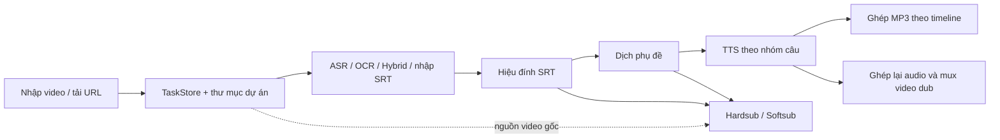

# Kiểm tra luồng chính VANHSUB — 05/10/2026

## Kết luận

VANHSUB có đủ các bước chính để nhập/tải video, tạo hoặc nhập SRT, hiệu đính, dịch, tạo giọng và xuất video. Các thuật toán phân đoạn, giữ timestamp khi dịch và render cơ bản vượt qua các bộ kiểm thử được chạy. Tuy nhiên, **chưa thể đánh giá luồng hoàn chỉnh là ổn định để dùng batch hoặc liên tục sửa rồi xuất lại**: có lỗi dùng đầu ra cũ, mất câu/audio, chọn sai nguồn âm thanh và xoá kết quả trước khi lần xử lý mới thành công.

Ưu tiên sửa tính đúng đắn và quản lý kết quả trước, sau đó tối ưu chi phí FFmpeg và cập nhật store. Chưa có căn cứ để viết lại toàn bộ thuật toán OCR/ASR.

Phạm vi: luồng phụ đề/lồng tiếng của ứng dụng; **không kiểm tra Workflow AI hoặc AI Studio**. Dịch/hiệu đính bằng Gemini thuộc luồng phụ đề nên nằm trong phạm vi. Tiêu chí nhu cầu được suy ra từ README, PROJECT và luồng UI hiện tại; chưa có bộ video/ngưỡng chất lượng riêng do người dùng cung cấp.

## Luồng hiện tại và mức đáp ứng



Nút “Chạy cả quy trình” hiện chạy ASR nếu thiếu SRT → dịch nếu thiếu bản dịch và có key → TTS nếu thiếu thư mục audio → dub. Nó không nối thêm bước hardsub/softsub. Các chế độ xuất đang là các nhánh riêng. Không xem việc nút này chạy đầy đủ là lỗi chỉ vì task có nhãn `fast-transcribe`.

| Nhu cầu | Đánh giá | Căn cứ/giới hạn |
|---|---|---|
| Nhập local, nhập SRT, tải nền | Có luồng | Tải nền có kiểm thử mock; tải thật theo từng nền tảng chưa được chạy. Có nguy cơ ghi đè khi trùng tên. |
| ASR, fallback, phân đoạn tự nhiên | Có, cần sửa biên chunk | Bộ word-segmenter/parity chạy thành công; merger có thể bỏ câu khác nội dung. Chưa đo WER trên lời nói thật. |
| OCR và Hybrid | Thuật toán fixture chạy tốt | Có tracking, confidence, khử lặp, giữ speech-only. Chưa chạy model OCR trên video thật; trích toàn bộ frame trước gây chi phí đĩa. |
| Hiệu đính rồi chạy tiếp | Chưa đáp ứng tin cậy | Lưu SRT không đánh dấu bản dịch/audio/video cũ cần tạo lại. |
| Dịch giữ timeline | Tốt ở mức kiểm thử | Bộ alignment/resilience giữ ID, timestamp, speaker; retry/checkpoint có kiểm thử. Dịch lại thất bại làm mất audio cũ. |
| TTS liền câu, sửa riêng một dòng | Chưa đáp ứng | Tạo lại dòng phá quan hệ nhóm; speaker trong SRT không được parser TTS tách ra. |
| Đồng bộ lồng tiếng | Có cơ chế rõ | Strict, flexible và video-stretch; có cảnh báo câu bị cắt khi nén quá 1.5x. Cần đo nghe thực tế trước khi khẳng định chất lượng. |
| Xuất sub cùng giọng đã dub | Thiếu bước nối | ExportRunner lấy video gốc, không lấy video vừa dub. |
| Video không có tiếng | Hardsub được kiểm thử; softsub lỗi | Softsub bắt buộc `-map 0:a`, FFmpeg báo thiếu stream. |
| Huỷ/batch/resume | Chưa đồng nhất | Có hàng đợi và reset job gián đoạn lúc khởi động. Huỷ TTS khi merge bị ghi đè thành done; mỗi runner có khoá riêng. |
| Tách nhạc/giọng | Có, chất lượng phụ thuộc backend | Demucs có fallback DSP. DSP L−R không tương đương tách nguồn bằng model; nội dung ở giữa hai kênh có thể bị triệt tiêu. Chưa đo chất lượng Demucs. |

## Phát hiện cần sửa

P1: có thể làm sai/mất nội dung hoặc dữ liệu trong một thao tác bình thường. P2: lỗi điều phối, trường hợp biên hoặc giới hạn tính năng. Các lỗi dưới đây chưa được sửa trong đợt kiểm tra này.

### F01 — P1: tạo lại một dòng TTS không cập nhật nhóm audio

Nguồn: [ttsEngine.ts:393](../main/render/ttsEngine.ts#L393), [dubbingEngine.ts:253](../main/render/dubbingEngine.ts#L253), [TTSPage.tsx:324](../renderer/components/TTSPage.tsx#L324).

- TTS gom hai dòng thành một nhóm, leader chứa audio cả câu. Tạo lại member ghi đúng MP3 mới nhưng leader vẫn giữ `groupIndices`; merger tiếp tục đọc audio leader cũ.
- Với fixture hai âm 440Hz/880Hz, hash PCM của bản ghép trước/sau tạo lại member giống hệt nhau. Nút UI thông báo tạo lại thành công và yêu cầu ghép vào video, nhưng thao tác đó không dùng audio mới.
- Tạo lại leader xoá cờ nhóm ở leader trong khi member vẫn có `isGroupMember`; merger bỏ qua member. Manifest được xác nhận còn tham chiếu leader không có nhóm.

Hướng sửa: chọn một đơn vị chỉnh sửa thống nhất. Hoặc tạo lại cả nhóm chứa dòng đó, hoặc tách nhóm thành các đoạn có audio độc lập; cập nhật manifest và đánh dấu MP3/video cần tạo lại cùng một lần.

### F02 — P1: xuất phụ đề sau khi dub lấy lại tiếng gốc

Nguồn: [exportRunner.ts:198](../main/render/exportRunner.ts#L198), [ExportPage.tsx:428](../renderer/components/ExportPage.tsx#L428).

ExportRunner luôn lấy `task.filePath`. Đã chạy softsub thật với source 220Hz và file dub 880Hz có trong `outputPath`: PCM video xuất khớp source, khác file dub. Hardsub cũng dùng cùng biến `videoPath`, được xác nhận bằng đọc mã.

Nếu nhu cầu là một video vừa có giọng mới vừa có phụ đề, hiện cần thao tác nhập lại video dub. Hướng sửa: lưu riêng nguồn video, video đã dub, hardsub và softsub; cho export chọn đầu vào rõ ràng. Không dùng một `outputPath` cho mọi loại kết quả.

### F03 — P1: lưu/nhập SRT không làm mất hiệu lực kết quả phụ thuộc

Nguồn: [main.ts:564](../main/main.ts#L564), [main.ts:595](../main/main.ts#L595), [main.ts:440](../main/main.ts#L440), [SubtitleEditor.tsx:710](../renderer/components/SubtitleEditor.tsx#L710).

Handler lưu chỉ ghi file; handler nhập chỉ đổi `srtPath`. Pipeline kiểm tra sự tồn tại của trường đường dẫn, không kiểm tra phiên bản nội dung. Sau khi sửa SRT, probe thực thi đúng handler/pipeline sản xuất ghi nhận chỉ gọi dubbing, tiếp tục dùng translation/TTS cũ.

Hướng sửa: mỗi artifact có dấu vân tay của nguồn và cấu hình. Sửa bản gốc → bản dịch/audio/video cần cập nhật; sửa bản dịch → audio/video cần cập nhật. Có thể giữ file cũ để phục hồi nhưng phải phân biệt kết quả cũ với kết quả còn hợp lệ.

### F04 — P1: hai video trùng basename dùng chung thư mục dự án

Nguồn: [projectFolder.ts:37](../main/utils/projectFolder.ts#L37), [videoDownloader.ts:1410](../main/helpers/videoDownloader.ts#L1410), [videoDownloader.ts:1428](../main/helpers/videoDownloader.ts#L1428).

Hai file `source-a/clip.mp4` và `source-b/clip.mp4`, khi chọn cùng exportDir, trả về cùng `clip_vanhsub`. Probe xác nhận đường dẫn bằng nhau. ASR/TTS/translation trong đó có thể ghi đè hoặc xoá kết quả của task kia.

Riêng nhánh tải bằng yt-dlp còn chủ động `unlinkSync` video đã tồn tại trước khi rename khi trùng tên, xác nhận bằng đọc mã. Chưa thực hiện tải mạng để tái hiện thao tác xoá này.

Hướng sửa: thêm task ID/ID nguồn vào thư mục; xác nhận quyền sở hữu artifact trước khi xoá. Tải lặp lại phải tạo bản mới hoặc chỉ tái sử dụng khi xác nhận cùng nguồn.

### F05 — P1: dịch lại thất bại đã xoá audio thành công trước đó

Nguồn: [translateRunner.ts:44](../main/translate/translateRunner.ts#L44), [translateRunner.ts:63](../main/translate/translateRunner.ts#L63).

TTS directory và MP3 bị xoá, các trường kết quả bị xoá trước khi `translateSrtFile` kiểm tra key. Probe không dùng mạng: tạo task có audio cũ, dịch lại khi thiếu key → status error nhưng cả audio directory và MP3 cũ đã biến mất. File bản dịch cũ có thể còn trên đĩa nhưng task mất tham chiếu.

Hướng sửa: kiểm tra điều kiện chạy trước; ghi phiên bản mới ra staging; chỉ chuyển tham chiếu sau thành công. Đánh dấu kết quả cũ hết hiệu lực mà không xoá ngay. ASR/OCR/Hybrid cũng cần áp dụng nguyên tắc này khi chạy lại.

### F06 — P1: merger chunk ASR bỏ câu khác nội dung ở biên

Nguồn: [whisperEngine.ts:169](../main/asr/whisperEngine.ts#L169).

Merger dùng overlap timestamp để bỏ cả dòng, không đối chiếu văn bản. Fixture chunk trước có câu 598–602s; chunk sau có câu khác 601–604s. Kết quả chỉ còn câu trước, mất cả phần lời thoại mới sau 602s. Đây là kiểm thử hàm merger thật; chưa đo tần suất xảy ra trên nhận diện thật.

Hướng sửa: đối chiếu token/text trong vùng overlap; giữ phần mới hoặc chọn kết quả có độ bao phủ tốt hơn. Không coi mọi câu chồng timestamp là bản sao.

### F07 — P2: huỷ TTS trong merge vẫn hoàn tất

Nguồn: [ttsRunner.ts:215](../main/render/ttsRunner.ts#L215), [ttsRunner.ts:233](../main/render/ttsRunner.ts#L233), [main.ts:500](../main/main.ts#L500).

Probe gọi cancel tại thời điểm runner chuyển sang ghép MP3: cancel trả true và status được đổi cancelled, nhưng runner vẫn merge rồi ghi done. `mergeAudioFiles` không nhận callback huỷ/handle tiến trình. Dubbing chỉ kiểm tra huỷ trước/sau merge nên cũng chưa dừng ngay được phần này.

Ngoài ra, `cancelTaskExecution` xoá slot pipeline trước khi tiến trình kết thúc. StemExportRunner không có cancel và không nằm trong danh sách runner được huỷ của handler tổng; xác nhận bằng đọc mã.

Hướng sửa: dùng run ID và trạng thái huỷ xuyên suốt; guard trước mọi bước chuyển/finalize; chỉ giải phóng slot khi promise kết thúc; quản lý mọi tiến trình con.

### F08 — P2: speaker metadata bị đưa vào lời đọc

Nguồn: [ttsEngine.ts:139](../main/render/ttsEngine.ts#L139), [ttsEngine.ts:90](../main/render/ttsEngine.ts#L90).

Parser TTS riêng không tách `[SPEAKER_XX]:` thành `speaker`, trong khi hàm grouping dựa trên `speaker`. Fixture hai speaker gửi một request chứa nguyên cả hai nhãn tới stub synthesis. Đã xác nhận payload; chưa gọi dịch vụ thật để kết luận giọng đọc cụ thể của nhãn.

Hướng sửa: dùng parser SRT chung, chuyển speaker sang metadata, áp dụng mapping giọng trước khi grouping.

### F09 — P2: softsub không chạy với video không có audio

Nguồn: [videoRenderer.ts:750](../main/render/videoRenderer.ts#L750).

Video synthetic không tiếng xuất softsub trả error: `Stream map '0:a' matches no streams`. Hướng sửa: audio map optional hoặc dựa vào metadata. Hardsub đã xử lý video không tiếng và có test tương ứng.

### F10 — P2: precondition pipeline chưa thống nhất

Nguồn: [main.ts:401](../main/main.ts#L401), [main.ts:440](../main/main.ts#L440), [main.ts:465](../main/main.ts#L465).

- Backend nhận enqueue khi status `ocr`; probe xác nhận true. UI batch có lọc OCR, nên lỗi này không xảy ra qua nút batch hiện tại nhưng backend chưa bảo vệ đầy đủ khỏi lời gọi khác/race.
- Source en, target vi nhưng không có key vẫn chạy TTS → dub source, không thực hiện dịch. Đây là hành vi hiện tại đã tái hiện, cần xác định chế độ “đọc nguyên văn” hoặc dừng với thông báo nếu người dùng yêu cầu dịch.
- `opts.replaceAudio` của IPC bị bỏ qua; pipeline luôn replace true. UI “Chạy cả quy trình” hiện không truyền lựa chọn này nên là giới hạn contract, không khẳng định nút mix trong tab Export bị lỗi.

## Thuật toán, hiệu năng và phần thừa

### Những điểm đã làm hợp lý

- Dịch giữ 1:1 ID/timestamp/speaker; ngắt dòng hiển thị không tự đổi timeline. Có kiểm tra output, retry, checkpoint và giới hạn concurrency 1–8.
- OCR lấy mẫu FPS trước crop/scale; có tracking, bình chọn text, confidence, xử lý progressive karaoke và speech-only trong Hybrid.
- `subtitleBuilder.levenshteinWithin` dùng hai hàng và thoát sớm; đây là hướng phù hợp cho so khớp giới hạn sai số.
- Softsub và mux dub dùng stream-copy video khi không cần biến đổi; không mặc định encode lại mọi thứ.
- ASR và export có hàng đợi; pipeline giới hạn hai job; startup gọi `resetStaleRunning`. Không kết luận thiếu phục hồi sau restart.
- Dubbing có giới hạn tempo, drift và báo câu bị cắt. Các giới hạn này là lựa chọn chất lượng cần nghe thử, không nên nâng tốc độ chỉ để xoá cảnh báo.

### Các tối ưu nên ưu tiên

| Điểm | Hiện trạng | Đề xuất |
|---|---|---|
| Ghép audio hai lần | TTSRunner tự merge MP3; dubVideo lại merge từ các nhóm | Cache bản timeline theo hash SRT + manifest + syncMode; tái dùng PCM/master cùng chế độ. Không tái dùng MP3 flexible cho dub strict một cách mù quáng. |
| Tiến trình FFmpeg theo nhóm | Mỗi nhóm probe duration rồi render segment; lặp tuần tự, dub còn làm lại | Cache duration, giảm số subprocess hoặc gộp render theo batch, thêm huỷ. Giữ timestamp và cảnh báo overrun. |
| TaskStore/progress | Mỗi update đọc, tìm rồi ghi cả mảng task; main broadcast cả danh sách | Giữ index/cache trong RAM, debounce ghi đĩa và broadcast delta. Flush ngay ở trạng thái cuối, không đánh đổi phục hồi crash. |
| Hybrid matching | Mỗi OCR segment `filter` cả danh sách Whisper: O(O×W) | Sort + con trỏ/cửa sổ thời gian hoặc interval index; giữ đúng semantics overlap. |
| Translation cache | Hydrate bằng `lines.find`; mỗi dòng quét `Object.entries(checkpointData)` | Map theo ID và source text. Đưa target language, glossary/style/model vào phiên bản cache nếu cấu hình thay đổi. |
| OCR frame storage | Xuất toàn bộ PNG trước khi nhận diện, video 1h ở 2fps có 7.200 frame | Xử lý theo chunk/stream và dọn sau khi tiêu thụ; crop sớm nếu người dùng chọn vùng. Cần benchmark chất lượng trước khi giảm FPS. |
| Model ASR | Python spawn/load WhisperModel mỗi lần; hai pipeline có thể cạnh tranh GPU | Sidecar giữ model và scheduler theo tài nguyên nếu benchmark chứng minh khởi tạo/VRAM là nút thắt. Chưa đo GPU trong đợt này. |

Microbenchmark trên máy hiện tại, chạy mã sản xuất bằng fixture local:

| Task đang lưu | 30 lần TaskStore.update | Trung bình/lần |
|---:|---:|---:|
| 100 | 179,54 ms | 5,98 ms |
| 1.000 | 328,39 ms | 10,95 ms |
| 5.000 | 844,78 ms | 28,16 ms |

Các lời gọi trên là đồng bộ; chưa tính broadcast/renderer. Vì vậy cập nhật dày có thể giữ main thread hàng chục ms mỗi lần khi lịch sử lớn. Đây là microbenchmark một lượt, không phải ngưỡng đảm bảo trên mọi máy.

Hybrid median của ba lượt, hai luồng cùng số segment, text khớp, không chồng lấn:

| Segment mỗi luồng | Số cặp duyệt lý thuyết | Median |
|---:|---:|---:|
| 500 | 250.000 | 26,09 ms |
| 1.000 | 1.000.000 | 53,96 ms |
| 2.000 | 4.000.000 | 117,04 ms |
| 4.000 | 16.000.000 | 226,79 ms |

Mã có vòng tìm ứng viên O(O×W), nhưng thời gian fixture này chưa biểu hiện tăng bậc hai rõ vì còn các chi phí khác. Không dùng số đo này để tuyên bố Hybrid là nút thắt lớn nhất; chi phí model/media cần đo riêng.

### Phần lặp/thừa cần dọn có chọn lọc

1. TTS copy **toàn bộ audio nhóm** ra mỗi member, làm tốn đĩa và preview member không đúng đoạn riêng. Copy chỉ khi file member chưa tồn tại nên còn có thể giữ bản cũ sau khi leader được tạo lại. Chuyển sang group reference + offset hoặc audio riêng có semantics rõ.
2. Ba parser SRT: parser chung và hai parser riêng trong TTS/dubbing. Hai parser riêng kém khả năng xử lý speaker/định dạng; đây là lặp gây lỗi thực tế, nên hợp nhất.
3. Faster-Whisper phân đoạn word trong Python rồi TypeScript phân đoạn lại và ghi đè SRT. Bộ parity 14/14 pass xác nhận hai bên tương thích fixture, nhưng vẫn là hai nơi giữ cùng logic và công việc lặp. Chọn nguồn chuẩn sau khi kiểm tra fallback, tránh xoá một nhánh đang phục vụ direct Python.
4. `segmentSubtitlesNetflix`/`consolidateSubtitleClauses` là nhánh cũ, không thấy caller sản xuất trực tiếp ngoài quan hệ nội bộ và test. Có thể chuyển thành legacy/test hoặc xoá sau khi bỏ các test cũ phụ thuộc.
5. Default/comment engine không nhất quán: generateTtsFromSrt khai báo/log VietTTS, grouping mặc định TikTok, runner fallback Edge. Chuẩn hoá một resolver; không đánh giá log là bằng chứng backend đã chạy.
6. `nodejs-whisper` **vẫn cung cấp asset/binary/model paths**, dù code không gọi API package. `renderer/lib/kineticEngine.ts` là re-export dùng chung. Không coi hai mục này là dependency/thuật toán thừa để xoá.

## Xác minh đã thực hiện

12/12 file suite có exit code 0, log được kiểm tra phần tổng kết:

| File trong `tests/` | Kết quả được báo |
|---|---|
| test_word_segmenter.ts | 9 nhóm kiểm thử pass |
| test_translator_alignment.ts | 29/29 |
| test_translation_resilience_and_layout.ts | 49/49 |
| test_subtitle_sanitizer.ts | 13/13 |
| test_hybrid_fusion.ts | 11/11 |
| test_r3_deduplication_engine.ts | 27/27 |
| test_subtitle_dedup_timestamps.ts | 50/50 |
| test_adversarial_parity_diarization.ts | 14/14, gồm parity Python và fuzz |
| test_benchmark_independent_verification.ts | assertion benchmark pass |
| test_r2_visual_wrapping_seamless_tts.ts | 21/21, có ghép audio thật |
| test_merged_mp3_and_background_download.ts | 4 nhóm pass; downloader manager dùng mock |
| test_r4_capcut_mini_export.ts | 68/68, có render synthetic có/không audio |

Typecheck `main`/`renderer` chạy thành công. Hai script audit cũng được typecheck riêng và chạy thành công.

Script [audit_core_flow.ts](../scripts/audit_core_flow.ts) xác nhận **12 hiện tượng** thuộc F01–F10. Exit 0 nghĩa là tái hiện đúng những hiện tượng hiện tại, **không có nghĩa app đã được sửa**. Synthesis thay bằng stub; merge/export/hash PCM dùng FFmpeg thật. Handler writeSrt/pipeline được lấy trực tiếp từ source rồi transpile/evaluate trong VM với runner stub, không khởi động Electron. Stores/media nằm trong thư mục tạm riêng; không dùng key/session hay sửa dữ liệu dự án thật.

```powershell
node node_modules/tsx/dist/cli.mjs scripts/audit_core_flow.ts
node node_modules/tsx/dist/cli.mjs scripts/audit_core_performance.ts
node node_modules/typescript/bin/tsc --noEmit --incremental false
```

Chưa chạy giao diện Electron tương tác, toàn bộ ASR/OCR/Demucs bằng model trên video thực, TTS network, tải thật YouTube/TikTok/Douyin/Bilibili hoặc build bộ cài. Kết quả này đánh giá logic và các integration media được nêu, không chứng nhận chất lượng tiếng Việt đầu cuối.

## Thứ tự xử lý đề xuất

1. F01/F03/F04/F05: tính nhất quán nhóm TTS, hiệu lực artifact, thư mục riêng và giữ kết quả cũ khi retry lỗi.
2. F02/F06/F08/F09: nối export với video dub, bảo toàn câu ở biên ASR, metadata speaker và silent video.
3. F07/F10: khoá task/run ID, huỷ xuyên suốt và precondition pipeline.
4. Cache timeline/duration và throttle progress; sau đó benchmark model/video thật để chọn tối ưu GPU/OCR phù hợp.
5. Bổ sung regression assertions theo hành vi mong muốn vào CI; audit probes hiện tại sẽ cần đổi kỳ vọng khi lỗi đã sửa. `package.json` hiện chưa có một lệnh test tập trung.
